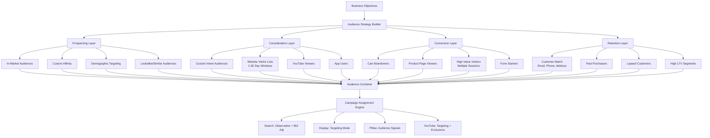

# Audience Targeting

Part of [Agent Skills™](https://github.com/itallstartedwithaidea/agent-skills) by [googleadsagent.ai™](https://googleadsagent.ai)

## Description

The Audience Targeting skill orchestrates Google Ads' full audience ecosystem to reach the right users at every stage of the conversion funnel. From broad prospecting with in-market and custom intent audiences to surgical remarketing with customer match and dynamic lists, this skill builds layered audience strategies that maximize reach efficiency while maintaining conversion quality.

Google Ads offers an increasingly complex audience taxonomy: in-market audiences (users actively researching products), custom intent audiences (defined by keywords and URLs), custom affinity audiences (defined by interests and behaviors), similar/lookalike audiences, customer match (first-party data uploads), remarketing lists (website visitors, app users, YouTube viewers), and combined audiences (boolean logic across segments). The skill navigates this complexity by mapping each audience type to its optimal funnel position and campaign objective.

For Performance Max campaigns, audience signals are particularly critical. While PMax uses automated targeting, the quality of audience signals dramatically influences where Google's algorithms focus initial exploration. This skill builds optimized audience signal packages combining first-party data, custom segments, and Google audiences to accelerate PMax learning phases and improve signal quality throughout the campaign lifecycle.

## Use When

- User asks about "audience targeting" or "audience strategy"
- User mentions "remarketing lists" or "retargeting setup"
- User wants to create "custom audiences" or "custom intent audiences"
- User asks about "in-market audiences" or "affinity audiences"
- User mentions "customer match" or "first-party data upload"
- User asks about "audience signals" for Performance Max
- User wants to "build lookalike audiences" or "similar audiences"
- User mentions "audience segmentation" or "audience layering"
- User asks to "expand reach" while maintaining conversion quality

## Architecture



## Implementation

Audience strategy builder with funnel mapping:

```javascript
const FUNNEL_STAGES = {
  AWARENESS: 'awareness',
  CONSIDERATION: 'consideration',
  CONVERSION: 'conversion',
  RETENTION: 'retention'
};

async function buildAudienceStrategy(customerId, config) {
  const { businessType, conversionGoal, firstPartyDataAvailable } = config;

  const existingAudiences = await getExistingAudiences(customerId);
  const conversionData = await getConversionAudienceData(customerId);

  const strategy = {
    prospecting: buildProspectingAudiences(businessType, conversionData),
    consideration: buildConsiderationAudiences(customerId, existingAudiences),
    conversion: buildConversionAudiences(customerId, existingAudiences),
    retention: firstPartyDataAvailable
      ? buildRetentionAudiences(customerId, config.crmData)
      : { available: false, recommendation: 'Upload customer list for Customer Match' }
  };

  return {
    audiences: strategy,
    pmaxSignals: buildPMaxAudienceSignals(strategy),
    exclusions: buildExclusionLists(strategy),
    bidAdjustments: calculateBidAdjustments(strategy, conversionData)
  };
}

function buildProspectingAudiences(businessType, conversionData) {
  const topConvertingInMarket = conversionData.inMarketSegments
    .sort((a, b) => b.conversionRate - a.conversionRate)
    .slice(0, 10);

  return {
    inMarket: {
      recommended: topConvertingInMarket,
      mode: 'observation_with_bid_adjustment',
      bidAdjustment: '+20%'
    },
    customAffinity: {
      interests: deriveAffinityInterests(businessType),
      mode: 'targeting',
      bestFor: 'display_and_youtube'
    },
    demographics: {
      age: conversionData.topConvertingAgeRanges,
      gender: conversionData.topConvertingGenders,
      income: conversionData.topConvertingIncomeRanges,
      mode: 'observation_with_bid_adjustment'
    }
  };
}

function buildConversionAudiences(customerId, existingAudiences) {
  return {
    cartAbandoners: {
      definition: { visitedPage: '/cart', didNotConvert: true, window: '7_days' },
      estimatedSize: existingAudiences.cartVisitors?.size || 'unknown',
      bidAdjustment: '+50%',
      priority: 'critical'
    },
    productViewers: {
      definition: { visitedPage: '/product/*', didNotConvert: true, window: '14_days' },
      estimatedSize: existingAudiences.productViewers?.size || 'unknown',
      bidAdjustment: '+30%',
      priority: 'high'
    },
    multiSessionVisitors: {
      definition: { sessionCount: '>= 3', didNotConvert: true, window: '30_days' },
      bidAdjustment: '+40%',
      priority: 'high'
    },
    formStarters: {
      definition: { startedForm: true, didNotSubmit: true, window: '14_days' },
      bidAdjustment: '+60%',
      priority: 'critical'
    }
  };
}
```

Customer Match and PMax audience signals:

```javascript
async function setupCustomerMatch(customerId, customerData) {
  const segments = segmentCustomerList(customerData);

  return {
    allCustomers: {
      listSize: customerData.length,
      matchRate: await estimateMatchRate(customerData),
      usage: 'exclusion_from_prospecting'
    },
    highLTV: {
      definition: segments.filter(c => c.ltv > segments.ltvP75),
      usage: 'seed_for_similar_audiences',
      bidAdjustment: '+30%'
    },
    lapsedCustomers: {
      definition: segments.filter(c => c.daysSinceLastPurchase > 90),
      usage: 'reactivation_campaigns',
      messaging: 'win_back_offers'
    },
    recentPurchasers: {
      definition: segments.filter(c => c.daysSinceLastPurchase <= 30),
      usage: 'cross_sell_upsell',
      exclusion: 'same_product_campaigns'
    }
  };
}

function buildPMaxAudienceSignals(strategy) {
  return {
    customSegments: [
      {
        name: 'High-Intent Searchers',
        type: 'custom_intent',
        keywords: strategy.topConvertingKeywords,
        urls: strategy.competitorUrls
      },
      {
        name: 'In-Market Converters',
        type: 'in_market',
        segments: strategy.prospecting.inMarket.recommended
      }
    ],
    yourData: [
      strategy.conversion.cartAbandoners,
      strategy.conversion.productViewers,
      strategy.retention?.highLTV
    ].filter(Boolean),
    demographics: strategy.prospecting.demographics,
    signalStrength: evaluateSignalStrength(strategy)
  };
}

function buildExclusionLists(strategy) {
  return {
    converters: {
      window: '30_days',
      excludeFrom: ['prospecting_campaigns', 'consideration_campaigns'],
      reason: 'prevent_wasted_spend_on_recent_converters'
    },
    bouncers: {
      definition: 'single_page_session_under_10s',
      excludeFrom: ['remarketing_campaigns'],
      reason: 'low_quality_traffic_not_worth_remarketing'
    },
    employees: {
      definition: 'ip_exclusion_or_customer_match',
      excludeFrom: ['all_campaigns'],
      reason: 'prevent_internal_click_waste'
    }
  };
}
```

## Integration with Buddy™ Agent

Audience Targeting is the reach intelligence layer within Buddy™ Agent. The platform continuously analyzes conversion data to identify which audience segments drive the highest value, automatically adjusting bid modifiers and recommending new audience builds based on emerging patterns.

Buddy™ manages the Customer Match lifecycle, including scheduled list refreshes from CRM integrations, match rate monitoring, and list hygiene. When match rates drop below thresholds, Buddy™ recommends data enrichment strategies. For PMax campaigns, Buddy™ evaluates audience signal quality and suggests signal refinements based on asset group performance data.

The skill integrates with the Remarketing Strategy skill for advanced retargeting orchestration, and coordinates with the Conversion Tracking skill to ensure audience membership rules fire correctly based on verified conversion events.

## Best Practices

1. Layer audiences in observation mode on Search campaigns before switching to targeting mode
2. Build remarketing lists with multiple duration windows (7, 14, 30, 90 days) for flexible targeting
3. Exclude recent converters from prospecting campaigns to prevent wasted spend
4. Refresh Customer Match lists monthly to maintain high match rates
5. Use custom intent audiences with competitor URLs and high-intent keywords for prospecting
6. Set minimum audience size of 1,000 users for Search remarketing and 100 for Display
7. Apply higher bid adjustments to audiences closer to conversion (cart abandoners > page viewers)
8. Combine audience targeting with keyword targeting for precision (RLSA)
9. Test in-market audiences in observation mode for 30 days before making bid adjustment decisions
10. Build separate PMax asset groups for different audience signal combinations to isolate performance

## Platform Compatibility

| Platform | Supported |
|----------|-----------|
| Claude Code | ✅ |
| Cursor | ✅ |
| Codex | ✅ |
| Gemini | ✅ |

## Related Skills

- [Remarketing Strategy](../remarketing-strategy/) - Remarketing lists are a core audience type; audience targeting powers retargeting orchestration
- [PMax Optimization](../pmax-optimization/) - Audience signals are critical inputs that accelerate Performance Max learning phases
- [Conversion Tracking](../conversion-tracking/) - Accurate conversion events ensure audience membership rules fire correctly
- [Entity Memory Management](../../ai-agent-engineering/entity-memory-management/) - Tracks audience segments and targeting decisions across agent sessions

## Keywords

audience targeting, remarketing lists, custom audiences, in-market audiences, custom intent, customer match, audience signals, performance max audiences, lookalike audiences, remarketing, RLSA, audience segmentation, audience strategy, google ads audiences, first-party data

---

© 2026 [googleadsagent.ai™](https://googleadsagent.ai) | [Agent Skills™](https://github.com/itallstartedwithaidea/agent-skills) | MIT License
