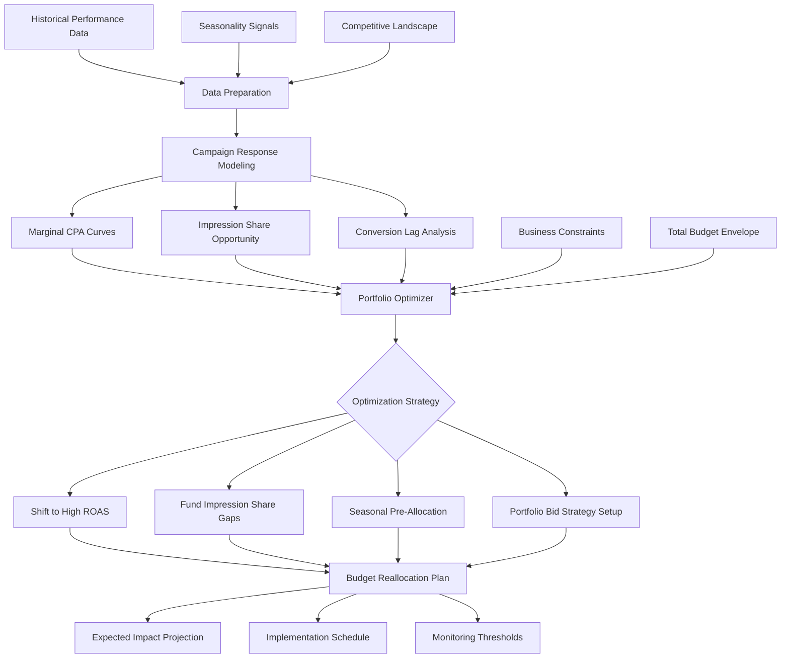

# Budget Optimization

Part of [Agent Skills™](https://github.com/itallstartedwithaidea/agent-skills) by [googleadsagent.ai™](https://googleadsagent.ai)

## Description

The Budget Optimization skill applies AI-driven forecasting and portfolio theory to allocate advertising budgets across campaigns for maximum return. Rather than treating each campaign as an isolated budget silo, this skill models the entire account as an investment portfolio, dynamically shifting spend toward campaigns with the highest marginal return on ad spend (ROAS) while respecting business constraints like minimum brand presence and geographic coverage.

The optimization engine ingests historical performance data, seasonality patterns, competitive dynamics, and conversion lag curves to build predictive models for each campaign's response to budget changes. It identifies campaigns that are impression-share-limited (underfunded relative to demand), campaigns with diminishing returns (overfunded past the efficient frontier), and campaigns where budget shifts would yield measurable incremental conversions.

Portfolio bidding strategies are a key lever. The skill evaluates whether campaigns should use individual or shared budgets, whether portfolio bid strategies can aggregate conversion signals across thin-data campaigns, and how seasonal budget adjustments should be timed relative to demand curves. It produces actionable budget reallocation plans with expected impact projections and confidence intervals.

## Use When

- User asks to "optimize my budget" or "allocate budget better"
- User mentions "budget pacing" or "campaigns running out of budget"
- User wants to know "where to increase spend" or "where to cut budget"
- User asks about "shared budgets" or "portfolio bidding"
- User mentions "ROAS optimization" or "maximize conversions within budget"
- User asks about "seasonal budget adjustments" or "budget planning"
- User wants to "reduce wasted spend" or "improve budget efficiency"
- User mentions "impression share lost to budget"

## Architecture



## Implementation

Budget optimization engine with marginal return modeling:

```javascript
async function optimizeBudgets(customerId, config) {
  const { totalBudget, lookbackDays = 90, constraints = {} } = config;

  const campaignData = await getCampaignPerformance(customerId, lookbackDays);
  const seasonalFactors = calculateSeasonalFactors(campaignData);
  const marginalCurves = buildMarginalReturnCurves(campaignData);

  const currentAllocation = campaignData.map(c => ({
    campaignId: c.id,
    name: c.name,
    currentBudget: c.dailyBudget,
    spend: c.avgDailySpend,
    conversions: c.avgDailyConversions,
    roas: c.conversionValue / c.cost,
    impressionShareLostBudget: c.isLostBudget,
    marginalCPA: marginalCurves[c.id].marginalCPA
  }));

  return portfolioOptimize(currentAllocation, totalBudget, constraints);
}

function buildMarginalReturnCurves(campaignData) {
  const curves = {};

  for (const campaign of campaignData) {
    const dailyData = campaign.dailyMetrics.sort((a, b) => a.cost - b.cost);
    const costBuckets = createCostBuckets(dailyData, 10);

    curves[campaign.id] = {
      marginalCPA: calculateMarginalCPA(costBuckets),
      saturationPoint: findSaturationPoint(costBuckets),
      elasticity: calculateBudgetElasticity(costBuckets)
    };
  }

  return curves;
}

function portfolioOptimize(campaigns, totalBudget, constraints) {
  const { minBrandSpend = 0, geoMinimums = {}, maxShift = 0.3 } = constraints;

  let remainingBudget = totalBudget;
  const allocations = [];

  const constrainedCampaigns = applyMinimumConstraints(campaigns, constraints);
  remainingBudget -= constrainedCampaigns.reduce((sum, c) => sum + c.allocatedBudget, 0);

  const flexibleCampaigns = campaigns.filter(c =>
    !constrainedCampaigns.find(cc => cc.campaignId === c.campaignId)
  );

  const sorted = flexibleCampaigns.sort((a, b) => a.marginalCPA - b.marginalCPA);

  for (const campaign of sorted) {
    const maxBudget = campaign.currentBudget * (1 + maxShift);
    const optimalBudget = Math.min(
      calculateOptimalBudget(campaign),
      maxBudget,
      remainingBudget
    );
    allocations.push({ ...campaign, newBudget: optimalBudget });
    remainingBudget -= optimalBudget;
  }

  return { allocations: [...constrainedCampaigns, ...allocations], unallocated: remainingBudget };
}
```

Seasonal budget adjustment planner:

```javascript
function planSeasonalAdjustments(campaignData, forecastWindow = 90) {
  const seasonalPatterns = detectSeasonality(campaignData, { minHistoryDays: 365 });

  return seasonalPatterns.map(pattern => ({
    campaignId: pattern.campaignId,
    upcomingPeaks: pattern.peaks.filter(p => p.daysAway <= forecastWindow),
    recommendedPreBudgetIncrease: pattern.peaks.map(peak => ({
      startDate: subtractDays(peak.date, 7),
      endDate: addDays(peak.date, 3),
      budgetMultiplier: peak.historicalLift,
      confidence: peak.confidence
    })),
    lowSeasons: pattern.troughs.filter(t => t.daysAway <= forecastWindow).map(trough => ({
      startDate: trough.startDate,
      endDate: trough.endDate,
      budgetMultiplier: trough.historicalDrop,
      reallocationTarget: findBestAlternative(campaignData, trough)
    }))
  }));
}
```

## Integration with Buddy™ Agent

Budget Optimization is the strategic resource allocation layer within Buddy™ Agent. The platform continuously monitors campaign pacing and triggers budget reallocation recommendations when it detects campaigns consistently hitting budget caps while others underspend. Buddy™ presents these recommendations with clear before/after projections.

Buddy™ integrates budget optimization with its seasonal awareness engine, automatically proposing budget increases ahead of known demand peaks (Black Friday, industry events, seasonal trends) and suggesting reductions during historically low-performing periods. Users receive proactive budget adjustment notifications with one-click approval.

The skill connects with the Conversion Tracking skill to ensure budget decisions are based on accurate attribution data, and coordinates with the Quality Score Optimization skill to prevent budget allocation toward campaigns with structural quality issues that would waste increased spend.

## Best Practices

1. Never optimize budgets without first verifying conversion tracking accuracy
2. Use a 90-day lookback minimum to capture enough data for reliable marginal return curves
3. Limit budget shifts to 20-30% per adjustment period to avoid algorithmic disruption
4. Set minimum spend constraints for brand campaigns regardless of ROAS ranking
5. Pre-load budgets 5-7 days before seasonal peaks to allow smart bidding to adjust
6. Monitor impression share lost to budget as the primary signal for underfunded campaigns
7. Consolidate campaigns with under 15 monthly conversions before optimizing budgets
8. Use shared budgets for campaigns targeting the same funnel stage with similar CPAs
9. Account for conversion lag when evaluating recent budget changes
10. Review portfolio bid strategy performance monthly and adjust target metrics accordingly

## Platform Compatibility

| Platform | Supported |
|----------|-----------|
| Claude Code | ✅ |
| Cursor | ✅ |
| Codex | ✅ |
| Gemini | ✅ |

## Related Skills

- [Conversion Tracking](../conversion-tracking/) - Budget decisions must be based on accurate attribution data
- [Quality Score Optimization](../quality-score-optimization/) - Prevents budget allocation toward campaigns with structural quality issues
- [Competitor Analysis](../competitor-analysis/) - Competitive pressure signals justify budget defense or reallocation
- [Token Optimization](../../ai-agent-engineering/token-optimization/) - Applies portfolio optimization principles to AI cost management

## Keywords

budget optimization, budget allocation, google ads budget, campaign budget, shared budgets, portfolio bidding, ROAS optimization, budget pacing, seasonal budgets, impression share budget, budget forecasting, media planning, spend optimization, cost efficiency, budget management

---

© 2026 [googleadsagent.ai™](https://googleadsagent.ai) | [Agent Skills™](https://github.com/itallstartedwithaidea/agent-skills) | MIT License
