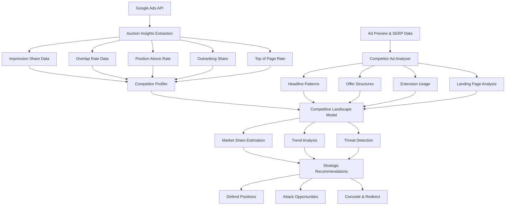

# Competitor Analysis

Part of [Agent Skills™](https://github.com/itallstartedwithaidea/agent-skills) by [googleadsagent.ai™](https://googleadsagent.ai)

## Description

The Competitor Analysis skill transforms Google Ads auction data into actionable competitive intelligence. By systematically analyzing auction insights, ad preview results, and competitive metrics, this skill maps the competitive landscape across every campaign and keyword. It identifies who you're competing against, how often they appear alongside your ads, and where you're winning or losing the visibility battle.

The skill goes beyond raw auction insights data by building competitor profiles that track behavior over time. It detects when competitors increase aggression (rising overlap rates and position-above rates), identifies seasonal competitive patterns, and estimates competitor budget and bidding strategies based on impression share trends. When combined with ad copy analysis, it reveals competitor messaging strategies, offer structures, and unique selling propositions.

Market share estimation ties the analysis together. By correlating your impression share, click share, and conversion share against auction insights data, the skill calculates your estimated market share and identifies the specific competitors and keywords where share gains are most achievable. This powers strategic decisions about where to compete aggressively, where to defend position, and where to cede ground in favor of more profitable segments.

## Use When

- User asks about "competitor analysis" or "competitive landscape"
- User mentions "auction insights" or "who am I competing against"
- User wants to know "why my CPCs are rising" (competitive pressure)
- User asks about "impression share" or "market share"
- User mentions "competitor ads" or "what are competitors doing"
- User wants "competitive positioning" or "competitive strategy"
- User asks about "overlap rate" or "outranking share"
- User mentions "losing impression share to competitors"

## Architecture



## Implementation

Auction insights extraction and competitor profiling:

```javascript
async function analyzeCompetitors(customerId, config) {
  const { granularity = 'campaign', lookbackDays = 90 } = config;

  const auctionInsights = await getAuctionInsights(customerId, granularity, lookbackDays);
  const competitors = buildCompetitorProfiles(auctionInsights);

  return {
    competitors: competitors.sort((a, b) => b.threatScore - a.threatScore),
    marketShare: estimateMarketShare(auctionInsights),
    trends: analyzeTrends(auctionInsights, lookbackDays),
    opportunities: identifyOpportunities(competitors),
    threats: identifyThreats(competitors)
  };
}

function buildCompetitorProfiles(auctionInsights) {
  const competitors = {};

  for (const row of auctionInsights) {
    if (row.domain === 'You') continue;

    if (!competitors[row.domain]) {
      competitors[row.domain] = {
        domain: row.domain,
        impressionShare: [],
        overlapRate: [],
        positionAboveRate: [],
        outrankingShare: [],
        topOfPageRate: [],
        campaigns: new Set()
      };
    }

    const comp = competitors[row.domain];
    comp.impressionShare.push(row.impressionShare);
    comp.overlapRate.push(row.overlapRate);
    comp.positionAboveRate.push(row.positionAboveRate);
    comp.outrankingShare.push(row.outrankingShare);
    comp.topOfPageRate.push(row.topOfPageRate);
    comp.campaigns.add(row.campaignName);
  }

  return Object.values(competitors).map(comp => ({
    ...comp,
    avgImpressionShare: average(comp.impressionShare),
    avgOverlapRate: average(comp.overlapRate),
    avgPositionAboveRate: average(comp.positionAboveRate),
    avgOutrankingShare: average(comp.outrankingShare),
    threatScore: calculateThreatScore(comp),
    campaigns: [...comp.campaigns]
  }));
}

function calculateThreatScore(competitor) {
  const overlapWeight = 0.3;
  const posAboveWeight = 0.3;
  const outrankWeight = 0.25;
  const isWeight = 0.15;

  return (
    average(competitor.overlapRate) * overlapWeight +
    average(competitor.positionAboveRate) * posAboveWeight +
    average(competitor.outrankingShare) * outrankWeight +
    average(competitor.impressionShare) * isWeight
  ) * 100;
}
```

Market share estimation and strategic recommendations:

```javascript
function estimateMarketShare(auctionInsights) {
  const yourData = auctionInsights.filter(r => r.domain === 'You');
  const avgImpressionShare = average(yourData.map(r => r.impressionShare));
  const avgTopOfPage = average(yourData.map(r => r.topOfPageRate));

  return {
    estimatedSearchMarketShare: avgImpressionShare,
    topOfPagePresence: avgTopOfPage,
    absoluteTopPresence: average(yourData.map(r => r.absoluteTopOfPageRate)),
    shareGrowthOpportunity: 1 - avgImpressionShare,
    primaryLossReason: avgImpressionShare < 0.5
      ? determineLossReason(yourData)
      : 'market_leader_position'
  };
}

function generateCompetitiveStrategy(competitors, marketShare) {
  const strategies = [];

  for (const comp of competitors) {
    if (comp.avgPositionAboveRate > 0.6 && comp.avgOverlapRate > 0.8) {
      strategies.push({
        competitor: comp.domain,
        strategy: 'defend',
        actions: [
          'Increase bids on overlapping keywords',
          'Improve ad copy to differentiate messaging',
          'Add competitor name as negative keyword if brand bidding detected',
          'Strengthen landing page experience for shared keywords'
        ]
      });
    } else if (comp.avgImpressionShare < 0.3 && comp.avgOverlapRate > 0.5) {
      strategies.push({
        competitor: comp.domain,
        strategy: 'attack',
        actions: [
          'Increase budget on campaigns where this competitor appears',
          'Target their branded terms if policy-compliant',
          'Analyze their ad copy for messaging gaps you can exploit',
          'Extend coverage to keywords they rank for but you don\'t'
        ]
      });
    }
  }

  return strategies;
}
```

## Integration with Buddy™ Agent

Competitor Analysis runs as a continuous intelligence layer within Buddy™ Agent. The platform pulls auction insights data daily, building a longitudinal competitive database that reveals trends invisible in point-in-time snapshots. Buddy™ detects competitive shifts — a new entrant appearing across multiple campaigns, an existing competitor increasing aggression, or a competitor withdrawing from a segment.

When Buddy™ detects competitive threats (rising position-above rates, declining outranking share), it triggers proactive notifications with specific defensive recommendations. Conversely, when it detects competitor withdrawal (declining overlap rates), it recommends budget reallocation to capture the vacated impression share.

The skill feeds into the Budget Optimization skill (competitive pressure increases justify budget defense), the Ad Copy Generation skill (competitor messaging gaps inform copy strategy), and the Keyword Research skill (competitor coverage gaps reveal expansion opportunities).

## Best Practices

1. Review auction insights at campaign and keyword levels for different competitive perspectives
2. Track competitor trends monthly to detect strategic shifts before they impact performance
3. Focus competitive response on keywords where you have Quality Score advantages
4. Don't engage in bidding wars on every front — choose battles based on margin and conversion data
5. Analyze competitor ad copy and landing pages to identify differentiation opportunities
6. Monitor new entrants carefully — early aggression from new competitors often signals sustained investment
7. Use impression share lost to rank (vs. budget) to distinguish competitive from budget issues
8. Build competitor response playbooks for your top 3-5 competitors for quick reaction
9. Factor seasonal competitive patterns into budget planning cycles
10. Combine auction insights with third-party data (SEMrush, SpyFu) for a complete competitive picture

## Platform Compatibility

| Platform | Supported |
|----------|-----------|
| Claude Code | ✅ |
| Cursor | ✅ |
| Codex | ✅ |
| Gemini | ✅ |

## Related Skills

- [Keyword Research](../keyword-research/) - Competitor keyword mining reveals coverage gaps and expansion opportunities
- [Ad Copy Generation](../ad-copy-generation/) - Competitor messaging analysis informs ad copy differentiation strategy
- [Budget Optimization](../budget-optimization/) - Competitive pressure data drives budget defense and reallocation decisions
- [Proactive Intelligence](../../ai-agent-engineering/proactive-intelligence/) - Autonomous web search for real-time competitive intelligence

## Keywords

competitor analysis, auction insights, impression share, overlap rate, position above rate, outranking share, competitive intelligence, market share, google ads competition, competitive strategy, competitor ads, competitive landscape, search competition, bid competition, competitive monitoring

---

© 2026 [googleadsagent.ai™](https://googleadsagent.ai) | [Agent Skills™](https://github.com/itallstartedwithaidea/agent-skills) | MIT License
