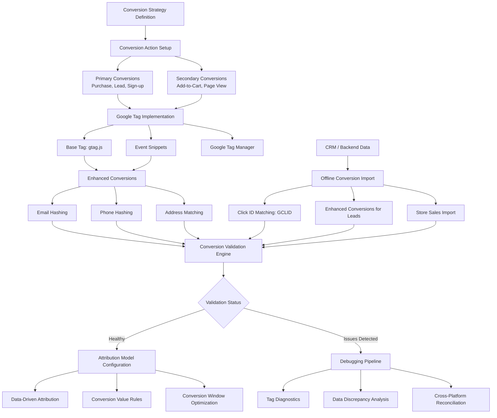

# Conversion Tracking

Part of [Agent Skills™](https://github.com/itallstartedwithaidea/agent-skills) by [googleadsagent.ai™](https://googleadsagent.ai)

## Description

The Conversion Tracking skill provides end-to-end management of Google Ads conversion measurement infrastructure. Accurate conversion tracking is the foundation of every optimization decision — without it, bid strategies, budget allocation, and keyword valuations are operating blind. This skill handles setup, validation, debugging, and attribution modeling across the full conversion stack: Google tag, enhanced conversions, offline conversion imports, and conversion value rules.

The skill covers the complete conversion action hierarchy: macro conversions (purchases, leads, sign-ups) that drive bidding, and micro conversions (page views, add-to-cart, video plays) that inform audience building and funnel analysis. It configures conversion windows, view-through settings, and counting methods (one-per-click vs. every) based on business model requirements. Enhanced conversions using first-party data (email, phone, address) are set up to recover measurement gaps caused by cookie deprecation and privacy regulations.

Attribution modeling is a critical component. The skill evaluates and configures data-driven attribution (DDA), compares it against last-click and other models, and helps advertisers understand the true value contribution of upper-funnel campaigns. For businesses with offline sales cycles, it manages the offline conversion import pipeline via CRM integration, ensuring that revenue data flows back to Google Ads for accurate ROAS calculation.

## Use When

- User asks about "conversion tracking setup" or "conversion configuration"
- User mentions "conversions not recording" or "missing conversions"
- User wants to "debug conversion tracking" or "verify tracking"
- User asks about "enhanced conversions" or "first-party data"
- User mentions "offline conversions" or "CRM import"
- User asks about "attribution modeling" or "data-driven attribution"
- User wants to "set up Google tag" or "configure gtag"
- User mentions "conversion value rules" or "conversion actions"
- User asks "why is smart bidding not working" (often tracking related)

## Architecture



## Implementation

Conversion tracking validation and debugging framework:

```javascript
async function validateConversionTracking(customerId) {
  const conversionActions = await getConversionActions(customerId);
  const tagDiagnostics = await runTagDiagnostics(customerId);
  const recentConversions = await getRecentConversions(customerId, 7);

  const issues = [];

  for (const action of conversionActions) {
    if (action.status !== 'ENABLED') continue;

    const validation = {
      actionName: action.name,
      category: action.category,
      tagInstalled: tagDiagnostics[action.id]?.installed ?? false,
      firingCorrectly: tagDiagnostics[action.id]?.recentFires > 0,
      conversionCount7d: recentConversions[action.id]?.count ?? 0,
      conversionLag: calculateConversionLag(recentConversions[action.id]),
      duplicateRate: detectDuplicates(recentConversions[action.id]),
      valueAccuracy: validateConversionValues(recentConversions[action.id])
    };

    if (!validation.tagInstalled) {
      issues.push({ action: action.name, severity: 'critical', issue: 'Tag not detected on website' });
    }
    if (!validation.firingCorrectly) {
      issues.push({ action: action.name, severity: 'critical', issue: 'Tag installed but not firing' });
    }
    if (validation.duplicateRate > 0.05) {
      issues.push({ action: action.name, severity: 'high', issue: `${(validation.duplicateRate * 100).toFixed(1)}% duplicate conversion rate detected` });
    }
  }

  return { conversionActions, issues, overallHealth: issues.length === 0 ? 'healthy' : 'needs_attention' };
}
```

Enhanced conversions setup:

```javascript
function generateEnhancedConversionTag(config) {
  const { conversionId, conversionLabel, dataSource } = config;

  return `
<!-- Google tag (gtag.js) - Enhanced Conversions -->
<script async src="https://www.googletagmanager.com/gtag/js?id=${conversionId}"></script>
<script>
  window.dataLayer = window.dataLayer || [];
  function gtag(){dataLayer.push(arguments);}
  gtag('js', new Date());
  gtag('config', '${conversionId}');

  gtag('set', 'user_data', {
    'email': hashUserEmail(),
    'phone_number': hashUserPhone(),
    'address': {
      'first_name': document.getElementById('first_name')?.value,
      'last_name': document.getElementById('last_name')?.value,
      'street': document.getElementById('street')?.value,
      'city': document.getElementById('city')?.value,
      'region': document.getElementById('region')?.value,
      'postal_code': document.getElementById('postal_code')?.value,
      'country': document.getElementById('country')?.value
    }
  });

  gtag('event', 'conversion', {
    'send_to': '${conversionId}/${conversionLabel}',
    'value': getTransactionValue(),
    'currency': 'USD',
    'transaction_id': getOrderId()
  });
</script>`;
}

async function setupOfflineConversionImport(customerId, crmConfig) {
  const { crmType, conversionActionName, uploadFrequency } = crmConfig;

  const pipeline = {
    source: crmType,
    gclidCapture: {
      method: 'hidden_form_field',
      fieldName: 'gclid',
      storageMethod: 'crm_custom_field',
      expirationDays: 90
    },
    conversionMapping: {
      crmStage: crmConfig.qualifiedStage,
      googleAdsAction: conversionActionName,
      valueField: crmConfig.dealValueField
    },
    uploadSchedule: {
      frequency: uploadFrequency,
      lookbackWindow: '30_days',
      deduplication: 'gclid_plus_timestamp'
    }
  };

  return pipeline;
}
```

Attribution model configuration:

```javascript
function configureAttribution(customerId, config) {
  const { preferredModel = 'DATA_DRIVEN' } = config;

  return {
    model: preferredModel,
    requirements: {
      dataDriven: {
        minConversions30d: 300,
        minClicks30d: 3000,
        eligible: config.conversions30d >= 300 && config.clicks30d >= 3000
      }
    },
    conversionValueRules: [
      { condition: 'audience_is_returning_customer', valueMultiplier: 1.5 },
      { condition: 'device_is_mobile', valueMultiplier: 0.8 },
      { condition: 'geo_is_tier1_market', valueMultiplier: 1.2 }
    ],
    conversionWindows: {
      clickThrough: config.salesCycleDays || 30,
      viewThrough: Math.min(config.salesCycleDays || 30, 30),
      engagedView: 3
    }
  };
}
```

## Integration with Buddy™ Agent

Conversion Tracking is the measurement foundation of the entire Buddy™ Agent platform. Before any optimization skill activates, Buddy™ runs the conversion validation pipeline to ensure data integrity. If tracking issues are detected, Buddy™ alerts the user and pauses optimization recommendations until the measurement foundation is sound.

Buddy™ continuously monitors conversion data for anomalies: sudden drops in conversion volume, unexpected changes in conversion rate, value discrepancies between Google Ads and backend systems, and tag firing failures. These anomalies trigger automated diagnostic workflows that identify root causes and suggest fixes.

For accounts with offline conversions, Buddy™ manages the automated import pipeline, ensuring CRM data flows back to Google Ads on schedule with proper GCLID matching. The platform tracks import success rates, identifies matching failures, and reconciles conversion data across platforms.

## Best Practices

1. Validate conversion tracking monthly by comparing Google Ads data against backend/CRM records
2. Use enhanced conversions to recover 5-15% of conversions lost to cookie restrictions
3. Set conversion counting to "one" for lead-gen and "every" for e-commerce
4. Configure conversion windows to match your actual sales cycle length
5. Use conversion value rules to differentiate high-value segments without changing tag code
6. Import offline conversions within 24 hours of the qualifying event when possible
7. Use data-driven attribution when eligible (300+ conversions/month) for most accurate credit assignment
8. Create a clear hierarchy: primary conversions for bidding, secondary for observation only
9. Deduplicate conversions using unique transaction IDs to prevent inflated reporting
10. Monitor the Google Ads tag diagnostics page weekly for tag health status

## Platform Compatibility

| Platform | Supported |
|----------|-----------|
| Claude Code | ✅ |
| Cursor | ✅ |
| Codex | ✅ |
| Gemini | ✅ |

## Related Skills

- [Google Ads Audit](../google-ads-audit/) - Conversion tracking validation is a foundational audit category
- [Budget Optimization](../budget-optimization/) - Accurate conversion data is essential for reliable budget allocation
- [Remarketing Strategy](../remarketing-strategy/) - Conversion events define post-conversion audience segments
- [Knowledge Base Injection](../../ai-agent-engineering/knowledge-base-injection/) - Domain patterns power automated conversion tracking diagnostics

## Keywords

conversion tracking, google tag, gtag, enhanced conversions, offline conversions, GCLID, conversion import, attribution modeling, data-driven attribution, conversion value rules, conversion actions, conversion debugging, conversion setup, google ads conversions, conversion validation

---

© 2026 [googleadsagent.ai™](https://googleadsagent.ai) | [Agent Skills™](https://github.com/itallstartedwithaidea/agent-skills) | MIT License
