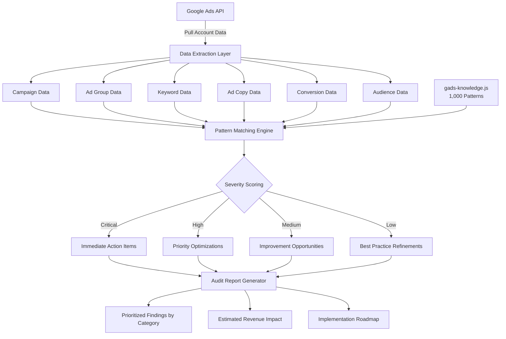

# Google Ads Account Audit

Part of [Agent Skills™](https://github.com/itallstartedwithaidea/agent-skills) by [googleadsagent.ai™](https://googleadsagent.ai)

## Description

The Google Ads Account Audit skill executes a comprehensive, pattern-driven analysis of any Google Ads account using a proprietary 1,000-pattern knowledge base. This is the most thorough automated audit available, covering all 20 audit categories: Campaign Structure, Bidding, Keywords, Ad Copy, Performance Max, Shopping, Audiences, Conversions, Budget, Quality Score, Search Terms, Display, Video/YouTube, Remarketing, Reporting, Account Structure, Landing Pages, Competitive Strategy, Automation, and Policy Compliance.

Each pattern in the knowledge base encodes a specific anti-pattern, threshold, or best practice violation derived from auditing thousands of Google Ads accounts across industries. The audit engine evaluates account data against these patterns, generates severity-scored findings, and produces prioritized recommendations with estimated impact. Findings are grouped by category and ranked by potential revenue impact, giving advertisers a clear roadmap for improvement.

The audit integrates directly with the Buddy™ Agent platform, enabling continuous monitoring rather than point-in-time snapshots. When deployed as a recurring audit, the skill tracks pattern resolution over time, measures improvement velocity, and alerts on regression. This transforms the traditional audit from a one-off consulting deliverable into an always-on optimization layer.

## Use When

- User asks to "audit my Google Ads account"
- User wants a "full account review" or "health check"
- User mentions "what's wrong with my campaigns"
- User asks to "find wasted spend" or "identify optimization opportunities"
- User requests "account diagnosis" or "performance analysis"
- User wants to "check campaign structure" or "review account settings"
- User asks "why is my CPC so high" or "why are my conversions dropping"
- User mentions "audit all 20 categories" or "comprehensive review"

## Architecture



## Implementation

The audit loads patterns from the knowledge base and evaluates each against live account data:

```javascript
import { GoogleAdsApi } from 'google-ads-api';
import { auditPatterns } from './gads-knowledge.js';

const AUDIT_CATEGORIES = [
  'campaign_structure', 'bidding', 'keywords', 'ad_copy',
  'pmax', 'shopping', 'audiences', 'conversions',
  'budget', 'quality_score', 'search_terms', 'display',
  'video_youtube', 'remarketing', 'reporting', 'account_structure',
  'landing_pages', 'competitive_strategy', 'automation', 'policy'
];

async function runFullAudit(customerId, credentials) {
  const client = new GoogleAdsApi({ ...credentials });
  const customer = client.Customer({ customer_id: customerId });

  const accountData = await extractAccountData(customer);
  const findings = [];

  for (const category of AUDIT_CATEGORIES) {
    const categoryPatterns = auditPatterns.filter(p => p.category === category);
    for (const pattern of categoryPatterns) {
      const result = await evaluatePattern(pattern, accountData);
      if (result.triggered) {
        findings.push({
          category,
          pattern_id: pattern.id,
          severity: result.severity,
          finding: result.description,
          recommendation: result.recommendation,
          estimated_impact: result.impact,
          affected_entities: result.entities
        });
      }
    }
  }

  return prioritizeFindings(findings);
}

async function extractAccountData(customer) {
  const campaigns = await customer.query(`
    SELECT campaign.id, campaign.name, campaign.status,
           campaign.bidding_strategy_type, campaign.budget.amount_micros,
           metrics.impressions, metrics.clicks, metrics.cost_micros,
           metrics.conversions, metrics.conversions_value
    FROM campaign
    WHERE segments.date DURING LAST_30_DAYS
  `);

  const keywords = await customer.query(`
    SELECT ad_group_criterion.keyword.text,
           ad_group_criterion.keyword.match_type,
           ad_group_criterion.quality_info.quality_score,
           metrics.impressions, metrics.clicks, metrics.cost_micros
    FROM keyword_view
    WHERE segments.date DURING LAST_30_DAYS
  `);

  return { campaigns, keywords };
}
```

Pattern definition structure in `gads-knowledge.js`:

```javascript
export const auditPatterns = [
  {
    id: 'KW-001',
    category: 'keywords',
    name: 'Broad Match Without Smart Bidding',
    severity: 'critical',
    condition: (data) => data.keywords.some(
      kw => kw.matchType === 'BROAD' &&
      !['TARGET_CPA', 'TARGET_ROAS', 'MAXIMIZE_CONVERSIONS']
        .includes(kw.campaignBiddingStrategy)
    ),
    description: 'Broad match keywords found without smart bidding, risking irrelevant traffic.',
    recommendation: 'Pair broad match keywords with Target CPA or Target ROAS bidding.',
    impact: 'high'
  },
  {
    id: 'BID-012',
    category: 'bidding',
    name: 'Insufficient Conversion Volume for Smart Bidding',
    severity: 'high',
    condition: (data) => data.campaigns.some(
      c => c.usesSmartBidding && c.conversions30d < 15
    ),
    description: 'Smart bidding campaigns with fewer than 15 conversions in 30 days.',
    recommendation: 'Consolidate campaigns or switch to portfolio bidding to aggregate signals.',
    impact: 'high'
  }
];
```

## Integration with Buddy™ Agent

The Google Ads Audit skill is the foundational diagnostic tool in the Buddy™ Agent platform. When a user connects their Google Ads account, Buddy™ automatically triggers an initial full audit across all 20 categories. Results populate the Buddy™ dashboard with severity-coded findings and a prioritized action queue.

Buddy™ uses audit findings to drive its proactive recommendation engine. Critical findings trigger immediate Slack/email notifications. High-severity findings are queued for the user's next session. The audit re-runs on a configurable schedule (daily, weekly, or monthly) to track resolution progress and detect new issues.

The audit skill feeds into downstream skills: keyword findings trigger the Keyword Research skill, ad copy findings trigger Ad Copy Generation, and Quality Score findings trigger the Quality Score Optimization skill.

## Best Practices

1. Run a full audit before making any account changes to establish a baseline
2. Prioritize critical and high-severity findings first for maximum impact
3. Schedule recurring audits weekly to catch regressions early
4. Use the 30-day lookback window for statistically significant data
5. Cross-reference audit findings with conversion tracking accuracy before acting
6. Export audit reports for stakeholder review before implementing changes
7. Track pattern resolution velocity to measure optimization team effectiveness
8. Customize severity thresholds based on account size and industry benchmarks
9. Combine automated findings with manual review for nuanced strategic issues
10. Use the audit trail to demonstrate value to clients in agency settings

## Platform Compatibility

| Platform | Supported |
|----------|-----------|
| Claude Code | ✅ |
| Cursor | ✅ |
| Codex | ✅ |
| Gemini | ✅ |

## Related Skills

- [Keyword Research](../keyword-research/) - Keyword audit findings trigger keyword expansion and negative keyword mining
- [Ad Copy Generation](../ad-copy-generation/) - Ad copy audit findings trigger new ad variant generation
- [Quality Score Optimization](../quality-score-optimization/) - Quality Score findings drive targeted QS improvement workflows
- [Parallel Agent Orchestration](../../ai-agent-engineering/parallel-agent-orchestration/) - Full account audits across 20 categories benefit from parallel subagent execution

## Keywords

google ads audit, ppc audit, account health check, campaign review, google ads optimization, ad account analysis, ppc analysis, google ads best practices, campaign audit checklist, wasted spend analysis, google ads diagnostics, performance review, account structure audit, bidding audit, keyword audit

---

© 2026 [googleadsagent.ai™](https://googleadsagent.ai) | [Agent Skills™](https://github.com/itallstartedwithaidea/agent-skills) | MIT License
