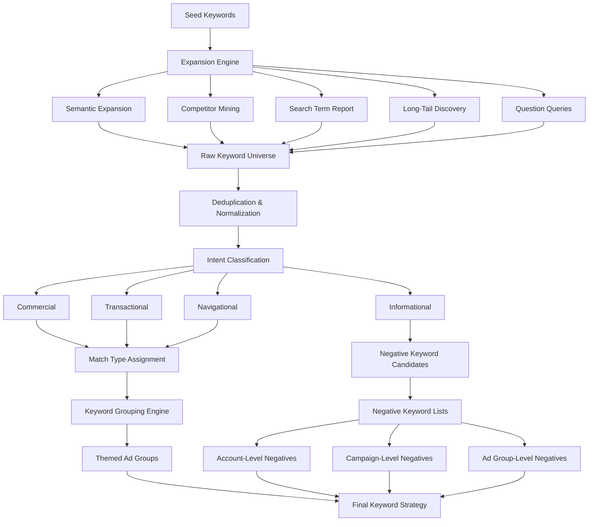

# Keyword Research

Part of [Agent Skills™](https://github.com/itallstartedwithaidea/agent-skills) by [googleadsagent.ai™](https://googleadsagent.ai)

## Description

The Keyword Research skill delivers a systematic approach to keyword discovery, expansion, and optimization for Google Ads campaigns. Starting from seed keywords, it builds comprehensive keyword universes through multiple expansion vectors: semantic variations, competitor keyword mining, search term report analysis, long-tail discovery, and intent-based grouping. The result is a structured keyword strategy that maximizes relevant coverage while minimizing wasted spend.

Match type selection is a critical component. The skill evaluates each keyword against conversion probability, search volume, competition intensity, and cost-per-click economics to recommend the optimal match type. Broad match keywords are paired with smart bidding strategies, phrase match captures high-intent variations, and exact match locks in proven converters. The skill continuously refines match type assignments based on search term report feedback loops.

Negative keyword management is equally important. The skill mines search term reports for irrelevant queries, builds hierarchical negative keyword lists (account-level, campaign-level, ad-group-level), and maintains shared negative keyword lists across campaigns. Proactive negative keyword discovery prevents budget waste before it occurs by identifying common irrelevant query patterns for each industry vertical.

## Use When

- User asks for "keyword research" or "keyword ideas"
- User wants to "expand keywords" or "find new keywords"
- User mentions "negative keywords" or "search term mining"
- User asks about "match types" (broad, phrase, exact)
- User wants to "reduce wasted spend" on irrelevant queries
- User asks to "build a keyword list" or "keyword strategy"
- User mentions "keyword grouping" or "ad group structure"
- User wants "long-tail keywords" or "low competition keywords"
- User asks to "analyze search terms" or "query mining"

## Architecture



## Implementation

Keyword expansion and match type assignment engine:

```javascript
const MATCH_TYPES = {
  BROAD: 'BROAD',
  PHRASE: 'PHRASE',
  EXACT: 'EXACT'
};

const INTENT_CATEGORIES = ['informational', 'commercial', 'transactional', 'navigational'];

async function expandKeywords(seedKeywords, config) {
  const { customerId, industry, maxKeywords = 500 } = config;

  const expansionResults = await Promise.all([
    semanticExpansion(seedKeywords),
    competitorKeywordMining(seedKeywords, industry),
    searchTermReportMining(customerId),
    longTailDiscovery(seedKeywords),
    questionQueryExpansion(seedKeywords)
  ]);

  const rawKeywords = deduplicateAndNormalize(expansionResults.flat());
  const classifiedKeywords = rawKeywords.map(kw => ({
    ...kw,
    intent: classifyIntent(kw.text),
    suggestedMatchType: assignMatchType(kw)
  }));

  return classifiedKeywords.slice(0, maxKeywords);
}

function assignMatchType(keyword) {
  if (keyword.conversionRate > 0.05 && keyword.volume < 1000) {
    return MATCH_TYPES.EXACT;
  }
  if (keyword.intent === 'transactional' && keyword.wordCount >= 3) {
    return MATCH_TYPES.PHRASE;
  }
  if (keyword.volume > 5000 && keyword.competitorPresence) {
    return MATCH_TYPES.BROAD;
  }
  return MATCH_TYPES.PHRASE;
}

function classifyIntent(keywordText) {
  const transactionalSignals = ['buy', 'order', 'purchase', 'price', 'cost', 'cheap', 'deal', 'discount', 'coupon', 'hire', 'book'];
  const commercialSignals = ['best', 'top', 'review', 'compare', 'vs', 'alternative', 'recommended'];
  const informationalSignals = ['how', 'what', 'why', 'when', 'guide', 'tutorial', 'tips'];

  const text = keywordText.toLowerCase();
  if (transactionalSignals.some(s => text.includes(s))) return 'transactional';
  if (commercialSignals.some(s => text.includes(s))) return 'commercial';
  if (informationalSignals.some(s => text.includes(s))) return 'informational';
  return 'commercial';
}
```

Negative keyword mining and list management:

```javascript
async function mineNegativeKeywords(customerId, lookbackDays = 30) {
  const searchTerms = await getSearchTermReport(customerId, lookbackDays);

  const negatives = searchTerms.filter(term => {
    const hasClicks = term.clicks > 0;
    const noConversions = term.conversions === 0;
    const highSpend = term.costMicros > 5000000;
    const lowCTR = term.ctr < 0.01;
    const irrelevantIntent = term.classifiedIntent === 'informational';

    return hasClicks && noConversions && (highSpend || lowCTR || irrelevantIntent);
  });

  return categorizeNegatives(negatives);
}

function buildNegativeKeywordLists(negatives) {
  return {
    accountLevel: negatives.filter(n => n.universallyIrrelevant),
    campaignLevel: groupBy(negatives.filter(n => n.campaignSpecific), 'campaignId'),
    adGroupLevel: groupBy(negatives.filter(n => n.adGroupSpecific), 'adGroupId'),
    sharedLists: buildSharedLists(negatives)
  };
}

function groupKeywordsIntoAdGroups(keywords, maxPerGroup = 20) {
  const groups = [];
  const themes = extractThemes(keywords);

  for (const theme of themes) {
    const themeKeywords = keywords.filter(kw => kw.theme === theme.id);
    if (themeKeywords.length <= maxPerGroup) {
      groups.push({ theme: theme.name, keywords: themeKeywords });
    } else {
      const subGroups = splitBySubTheme(themeKeywords, maxPerGroup);
      groups.push(...subGroups);
    }
  }

  return groups;
}
```

## Integration with Buddy™ Agent

The Keyword Research skill serves as the strategic foundation within Buddy™ Agent. When a user connects their account, Buddy™ immediately analyzes existing keyword coverage and identifies expansion opportunities. The skill runs continuously in the background, monitoring search term reports for emerging query patterns and new negative keyword candidates.

Buddy™ presents keyword recommendations through an interactive interface where users can approve, modify, or reject suggestions before they're applied. Approved keywords flow into the appropriate campaigns with match types and bids pre-configured based on predicted performance. Negative keywords are automatically categorized and applied at the correct level.

The skill cross-references with the Competitor Analysis skill to identify keyword gaps where competitors are capturing traffic the account is missing, and feeds into the Ad Copy Generation skill to ensure new keywords have corresponding ad copy.

## Best Practices

1. Start with 5-10 core seed keywords that represent your highest-value products or services
2. Group keywords by intent and theme into tightly themed ad groups of 10-20 keywords
3. Use exact match for proven high-converting terms to maintain bid precision
4. Pair broad match exclusively with smart bidding strategies (Target CPA, Target ROAS)
5. Review search term reports weekly and add negatives before wasted spend accumulates
6. Build shared negative keyword lists for universally irrelevant terms (jobs, free, DIY)
7. Include long-tail keywords (3+ words) to capture specific, high-intent searches
8. Monitor keyword Quality Scores and pause keywords consistently scoring below 4
9. Use campaign-level negatives to prevent keyword cannibalization between campaigns
10. Re-run keyword expansion quarterly to capture seasonal and trending queries

## Platform Compatibility

| Platform | Supported |
|----------|-----------|
| Claude Code | ✅ |
| Cursor | ✅ |
| Codex | ✅ |
| Gemini | ✅ |

## Related Skills

- [Ad Copy Generation](../ad-copy-generation/) - New keywords require corresponding ad copy with keyword-ad alignment
- [Competitor Analysis](../competitor-analysis/) - Competitor keyword gaps reveal expansion opportunities
- [Quality Score Optimization](../quality-score-optimization/) - Keyword Quality Scores guide match type and ad group restructuring decisions
- [Knowledge Base Injection](../../ai-agent-engineering/knowledge-base-injection/) - Domain knowledge patterns power automated keyword intent classification

## Keywords

keyword research, keyword expansion, negative keywords, match type optimization, broad match, phrase match, exact match, search term mining, keyword grouping, ad group structure, long-tail keywords, keyword intent, keyword strategy, google ads keywords, ppc keywords

---

© 2026 [googleadsagent.ai™](https://googleadsagent.ai) | [Agent Skills™](https://github.com/itallstartedwithaidea/agent-skills) | MIT License
