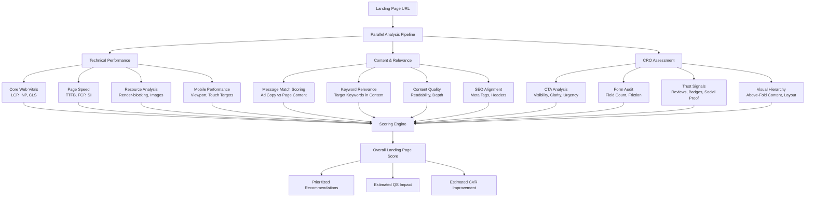

# Landing Page Audit

Part of [Agent Skills™](https://github.com/itallstartedwithaidea/agent-skills) by [googleadsagent.ai™](https://googleadsagent.ai)

## Description

The Landing Page Audit skill performs comprehensive evaluations of post-click experiences, combining technical performance analysis with conversion rate optimization (CRO) assessment. Landing page quality directly impacts Google Ads Quality Score, conversion rates, and ultimately the profitability of every advertising dollar. This skill audits the three pillars of landing page effectiveness: speed, relevance, and persuasion.

Technical performance analysis centers on Core Web Vitals — Largest Contentful Paint (LCP), First Input Delay (FID) / Interaction to Next Paint (INP), and Cumulative Layout Shift (CLS). Google uses these metrics as direct signals for landing page experience scoring. The skill measures real-world performance across devices, identifies render-blocking resources, analyzes critical rendering paths, and produces actionable speed optimization recommendations with estimated Quality Score impact.

The relevance and CRO layer evaluates message match between ad copy and landing page content, assesses call-to-action clarity and prominence, analyzes form design and friction points, checks mobile responsiveness, evaluates trust signals (reviews, certifications, security indicators), and benchmarks conversion elements against industry-specific best practices. The output is a scored assessment with prioritized improvement recommendations ranked by expected conversion rate impact.

## Use When

- User asks for a "landing page audit" or "page review"
- User mentions "landing page experience" Quality Score component
- User wants to "improve conversion rate" or "CRO analysis"
- User asks about "page speed" or "Core Web Vitals"
- User mentions "low conversion rate" on specific pages
- User wants to "improve Quality Score" landing page component
- User asks about "mobile landing page" performance
- User mentions "message match" between ads and landing pages
- User wants "form optimization" or "CTA optimization" advice

## Architecture



## Implementation

Core Web Vitals and technical performance analysis:

```javascript
async function auditLandingPage(url, config) {
  const { adCopyText, targetKeywords, device = 'both' } = config;

  const [technical, content, cro] = await Promise.all([
    runTechnicalAudit(url, device),
    runContentAudit(url, adCopyText, targetKeywords),
    runCROAudit(url, device)
  ]);

  const overallScore = calculateOverallScore(technical, content, cro);

  return {
    url,
    overallScore,
    technical,
    content,
    cro,
    recommendations: prioritizeRecommendations(technical, content, cro),
    estimatedQSImpact: estimateQualityScoreImpact(overallScore),
    estimatedCVRImprovement: estimateCVRImprovement(cro)
  };
}

async function runTechnicalAudit(url, device) {
  const mobileMetrics = device !== 'desktop' ? await measurePerformance(url, 'mobile') : null;
  const desktopMetrics = device !== 'mobile' ? await measurePerformance(url, 'desktop') : null;

  const metrics = mobileMetrics || desktopMetrics;

  return {
    coreWebVitals: {
      lcp: { value: metrics.lcp, rating: rateLCP(metrics.lcp) },
      inp: { value: metrics.inp, rating: rateINP(metrics.inp) },
      cls: { value: metrics.cls, rating: rateCLS(metrics.cls) }
    },
    additionalMetrics: {
      ttfb: metrics.ttfb,
      fcp: metrics.fcp,
      speedIndex: metrics.speedIndex,
      totalBlockingTime: metrics.tbt
    },
    resourceAnalysis: {
      renderBlockingResources: metrics.renderBlocking,
      unoptimizedImages: metrics.unoptimizedImages,
      unusedCSS: metrics.unusedCSS,
      unusedJS: metrics.unusedJS,
      totalPageWeight: metrics.totalBytes
    },
    mobileUsability: {
      viewportConfigured: metrics.hasViewport,
      textReadable: metrics.fontSizeAdequate,
      touchTargetsSized: metrics.touchTargetsAdequate,
      contentFitsViewport: metrics.noHorizontalScroll
    }
  };
}

function rateLCP(ms) {
  if (ms <= 2500) return { score: 'good', color: 'green' };
  if (ms <= 4000) return { score: 'needs_improvement', color: 'orange' };
  return { score: 'poor', color: 'red' };
}

function rateINP(ms) {
  if (ms <= 200) return { score: 'good', color: 'green' };
  if (ms <= 500) return { score: 'needs_improvement', color: 'orange' };
  return { score: 'poor', color: 'red' };
}

function rateCLS(value) {
  if (value <= 0.1) return { score: 'good', color: 'green' };
  if (value <= 0.25) return { score: 'needs_improvement', color: 'orange' };
  return { score: 'poor', color: 'red' };
}
```

Message match and CRO assessment:

```javascript
function scoreMessageMatch(adCopy, pageContent) {
  const adHeadlines = adCopy.headlines.map(h => h.toLowerCase());
  const adDescriptions = adCopy.descriptions.map(d => d.toLowerCase());
  const pageText = pageContent.toLowerCase();

  let matchScore = 0;

  const headlineMatches = adHeadlines.filter(h =>
    pageText.includes(h) || fuzzyMatch(h, pageText) > 0.8
  );
  matchScore += (headlineMatches.length / adHeadlines.length) * 40;

  const keyPhrases = extractKeyPhrases([...adHeadlines, ...adDescriptions]);
  const phraseMatches = keyPhrases.filter(p => pageText.includes(p));
  matchScore += (phraseMatches.length / keyPhrases.length) * 30;

  const aboveFoldContent = pageContent.aboveFold?.toLowerCase() || '';
  const aboveFoldRelevance = keyPhrases.filter(p => aboveFoldContent.includes(p));
  matchScore += (aboveFoldRelevance.length / keyPhrases.length) * 30;

  return {
    score: Math.round(matchScore),
    headlinePresence: headlineMatches,
    missingPhrases: keyPhrases.filter(p => !pageText.includes(p)),
    aboveFoldRelevance: aboveFoldRelevance.length / keyPhrases.length
  };
}

function auditCTA(pageData) {
  return {
    ctaPresent: pageData.ctaElements.length > 0,
    ctaAboveFold: pageData.ctaElements.some(cta => cta.yPosition < pageData.viewportHeight),
    ctaContrast: pageData.ctaElements.map(cta => ({
      text: cta.text,
      contrastRatio: calculateContrast(cta.color, cta.backgroundColor),
      meetsWCAG: calculateContrast(cta.color, cta.backgroundColor) >= 4.5
    })),
    ctaClarity: evaluateCTAText(pageData.ctaElements),
    ctaCount: pageData.ctaElements.length,
    recommendation: pageData.ctaElements.length === 0
      ? 'Add a clear, prominent CTA above the fold'
      : pageData.ctaElements.length > 3
        ? 'Reduce CTA options to avoid choice paralysis'
        : 'CTA count is appropriate'
  };
}

function auditForm(formData) {
  return {
    fieldCount: formData.fields.length,
    frictionScore: calculateFormFriction(formData),
    recommendations: [
      formData.fields.length > 5 && 'Reduce form fields to 3-5 for higher completion rates',
      !formData.hasProgressIndicator && formData.steps > 1 && 'Add progress indicator for multi-step forms',
      !formData.hasInlineValidation && 'Add inline validation to reduce submission errors',
      formData.requiredFields > formData.fields.length * 0.8 && 'Mark fewer fields as required to reduce friction'
    ].filter(Boolean)
  };
}
```

## Integration with Buddy™ Agent

The Landing Page Audit skill operates within Buddy™ Agent as the post-click quality assurance layer. When the Google Ads Audit detects "below average" landing page experience scores on high-spend keywords, Buddy™ automatically triggers landing page audits for the associated URLs with the relevant ad copy and keywords pre-loaded for message match analysis.

Buddy™ maintains a landing page performance database, tracking Core Web Vitals and conversion rates for every URL receiving ad traffic. It detects performance regressions (speed degradation, CLS increases after site updates) and alerts users before Quality Score impacts materialize. The platform also monitors message match when ad copy changes, ensuring landing page content stays aligned with updated messaging.

For agencies managing multiple clients, Buddy™ aggregates landing page insights across accounts, identifying systematic issues (common CMS performance problems, shared template weaknesses) that can be addressed at scale.

## Best Practices

1. Target LCP under 2.5 seconds on mobile as the single most impactful speed metric
2. Ensure primary CTA is visible above the fold on both mobile and desktop
3. Match the exact language from your top-performing ad headlines on the landing page
4. Limit form fields to the minimum necessary — each additional field reduces conversion rate by 4-7%
5. Include at least three trust signals: customer reviews, security badges, industry certifications
6. Test pages on real mobile devices, not just responsive desktop previews
7. Compress images to WebP format and implement lazy loading for below-fold content
8. Use a single, clear CTA per page section to avoid decision paralysis
9. Audit landing pages quarterly and after any significant site updates
10. A/B test landing page variations with sufficient traffic (500+ sessions per variant minimum)

## Platform Compatibility

| Platform | Supported |
|----------|-----------|
| Claude Code | ✅ |
| Cursor | ✅ |
| Codex | ✅ |
| Gemini | ✅ |

## Related Skills

- [Quality Score Optimization](../quality-score-optimization/) - Landing page experience is one of three Quality Score sub-components
- [Ad Copy Generation](../ad-copy-generation/) - Message match between ad copy and landing page content affects relevance and conversions
- [Conversion Tracking](../conversion-tracking/) - Landing page CRO improvements directly impact conversion rates and tracking accuracy
- [Long-Horizon Workflows](../../ai-agent-engineering/long-horizon-workflows/) - Multi-page site audits benefit from phased, checkpointed workflow execution

## Keywords

landing page audit, core web vitals, page speed, conversion rate optimization, CRO, message match, CTA optimization, form optimization, mobile landing page, landing page experience, quality score landing page, LCP, INP, CLS, page performance

---

© 2026 [googleadsagent.ai™](https://googleadsagent.ai) | [Agent Skills™](https://github.com/itallstartedwithaidea/agent-skills) | MIT License
