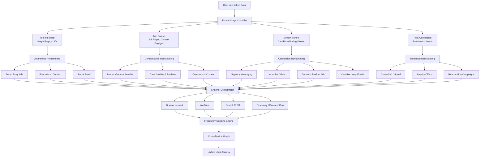

# Remarketing Strategy

Part of [Agent Skills™](https://github.com/itallstartedwithaidea/agent-skills) by [googleadsagent.ai™](https://googleadsagent.ai)

## Description

The Remarketing Strategy skill designs and implements cross-channel remarketing architectures that re-engage users at every stage of the conversion funnel. Remarketing is consistently the highest-ROI tactic in digital advertising because it targets users who have already demonstrated interest. This skill transforms basic "show ads to past visitors" approaches into sophisticated, funnel-aware remarketing systems with sequential messaging, frequency controls, and cross-device orchestration.

The skill segments audiences by funnel position and engagement depth: top-of-funnel visitors (single-page sessions), mid-funnel engagers (multi-page sessions, content consumers), bottom-of-funnel prospects (cart abandoners, form starters, pricing page viewers), and post-conversion customers (for upsell and retention). Each segment receives tailored messaging that matches their relationship with the brand, from awareness reinforcement to urgency-driven conversion nudges.

Cross-channel execution spans Display remarketing, YouTube remarketing, RLSA (Remarketing Lists for Search Ads), dynamic remarketing with product-specific creative, and customer journey mapping across devices. The skill implements frequency capping to prevent ad fatigue, membership duration optimization to balance reach and relevance, and sequential messaging chains that progressively move users toward conversion. It also manages negative audience layering to prevent redundant messaging and wasted impressions.

## Use When

- User asks about "remarketing" or "retargeting" strategy
- User mentions "remarketing lists" or "audience segmentation"
- User wants to "re-engage" past visitors or abandoned carts
- User asks about "frequency capping" or "ad fatigue"
- User mentions "RLSA" or "remarketing for search"
- User asks about "dynamic remarketing" or "product remarketing"
- User wants to build a "customer journey" or "sequential messaging"
- User mentions "cross-device" targeting or "cross-channel" remarketing
- User asks about "membership duration" or "audience window" optimization

## Architecture



## Implementation

Funnel-based audience segmentation and remarketing architecture:

```javascript
const FUNNEL_SEGMENTS = {
  TOP: {
    name: 'Awareness Visitors',
    rules: { pagesViewed: 1, sessionDuration: '<30s', converted: false },
    membershipDuration: 30,
    messagingStrategy: 'brand_awareness',
    channels: ['display', 'youtube'],
    frequencyCap: { impressionsPerDay: 3, impressionsPerWeek: 10 }
  },
  MID: {
    name: 'Engaged Visitors',
    rules: { pagesViewed: '>=2', sessionDuration: '>=30s', converted: false },
    membershipDuration: 30,
    messagingStrategy: 'consideration',
    channels: ['display', 'youtube', 'search_rlsa'],
    frequencyCap: { impressionsPerDay: 5, impressionsPerWeek: 15 }
  },
  BOTTOM: {
    name: 'High Intent Prospects',
    rules: { viewedHighIntentPage: true, converted: false },
    membershipDuration: 14,
    messagingStrategy: 'conversion',
    channels: ['display', 'youtube', 'search_rlsa', 'demand_gen'],
    frequencyCap: { impressionsPerDay: 7, impressionsPerWeek: 25 }
  },
  POST_CONVERSION: {
    name: 'Customers',
    rules: { converted: true },
    membershipDuration: 180,
    messagingStrategy: 'retention',
    channels: ['display', 'youtube', 'search_rlsa'],
    frequencyCap: { impressionsPerDay: 2, impressionsPerWeek: 7 }
  }
};

async function buildRemarketingStrategy(customerId, config) {
  const { businessType, conversionActions, hasDynamicFeed } = config;

  const existingLists = await getRemarketingLists(customerId);
  const conversionData = await getFunnelConversionData(customerId);

  const strategy = {
    segments: buildFunnelSegments(conversionData, businessType),
    sequentialMessaging: designSequentialChains(conversionData),
    dynamicRemarketing: hasDynamicFeed ? configureDynamic(customerId) : null,
    rlsaStrategy: configureRLSA(conversionData),
    frequencyCapping: optimizeFrequencyCaps(conversionData),
    exclusions: buildExclusionMatrix(),
    crossDeviceStrategy: configureCrossDevice(customerId)
  };

  return strategy;
}

function buildFunnelSegments(conversionData, businessType) {
  const segments = [];

  for (const [stage, config] of Object.entries(FUNNEL_SEGMENTS)) {
    const windows = stage === 'BOTTOM'
      ? [1, 3, 7, 14]
      : stage === 'MID'
        ? [7, 14, 30]
        : [14, 30, 60, 90];

    for (const window of windows) {
      segments.push({
        name: `${config.name} - ${window}d`,
        funnelStage: stage,
        membershipDuration: window,
        rules: config.rules,
        estimatedSize: estimateAudienceSize(conversionData, config.rules, window),
        bidAdjustment: calculateBidAdjustment(stage, window),
        messagingTheme: config.messagingStrategy
      });
    }
  }

  return segments;
}

function calculateBidAdjustment(stage, windowDays) {
  const baseAdjustments = { TOP: 0, MID: 20, BOTTOM: 50, POST_CONVERSION: 15 };
  const recencyBoost = Math.max(0, 30 - windowDays);
  return `+${baseAdjustments[stage] + recencyBoost}%`;
}
```

Sequential messaging and dynamic remarketing:

```javascript
function designSequentialChains(conversionData) {
  return {
    newVisitorChain: [
      { day: 1, message: 'brand_introduction', creative: 'brand_video_15s', channel: 'youtube' },
      { day: 3, message: 'value_proposition', creative: 'benefit_display_ads', channel: 'display' },
      { day: 7, message: 'social_proof', creative: 'testimonial_ads', channel: 'display' },
      { day: 14, message: 'soft_cta', creative: 'content_offer', channel: 'demand_gen' }
    ],
    cartAbandonerChain: [
      { hour: 1, message: 'cart_reminder', creative: 'dynamic_product_ads', channel: 'display' },
      { day: 1, message: 'urgency', creative: 'limited_stock_messaging', channel: 'display' },
      { day: 3, message: 'incentive', creative: 'discount_offer', channel: 'display' },
      { day: 7, message: 'alternative_products', creative: 'related_products', channel: 'display' }
    ],
    customerRetentionChain: [
      { day: 30, message: 'thank_you', creative: 'loyalty_offer', channel: 'display' },
      { day: 60, message: 'cross_sell', creative: 'complementary_products', channel: 'display' },
      { day: 90, message: 'reactivation', creative: 'win_back_offer', channel: 'demand_gen' }
    ]
  };
}

function configureDynamic(customerId) {
  return {
    feedRequirements: {
      requiredAttributes: ['id', 'title', 'image_link', 'price', 'final_url'],
      recommendedAttributes: ['sale_price', 'brand', 'custom_label'],
      feedSource: 'merchant_center_or_custom'
    },
    templateStrategy: {
      singleProduct: { layout: 'product_image_price_cta', bestFor: 'product_page_viewers' },
      multiProduct: { layout: 'carousel_recently_viewed', bestFor: 'category_browsers' },
      offerOverlay: { layout: 'product_with_promo_badge', bestFor: 'cart_abandoners_with_offer' }
    },
    responsiveDisplayAds: {
      headlines: ['Come Back for {product_name}', 'Still Interested?', 'Don\'t Miss Out'],
      descriptions: ['Complete your purchase today.', 'Limited stock available.'],
      promotionText: 'Free shipping on orders over $50'
    }
  };
}

function configureRLSA(conversionData) {
  return {
    bidOnlyMode: {
      audiences: ['all_visitors_30d', 'engaged_visitors_30d'],
      bidAdjustments: {
        all_visitors: '+15%',
        engaged_visitors: '+30%',
        cart_abandoners: '+50%'
      },
      useCase: 'Increase bids for past visitors on existing keywords'
    },
    targetAndBidMode: {
      audiences: ['cart_abandoners_14d', 'past_purchasers_180d'],
      additionalKeywords: ['broad_match_generic_terms'],
      useCase: 'Show ads on broader queries only to high-intent past visitors'
    }
  };
}

function buildExclusionMatrix() {
  return {
    rules: [
      { campaign: 'prospecting', exclude: ['all_visitors_30d'] },
      { campaign: 'consideration_remarketing', exclude: ['converters_30d', 'top_of_funnel_only'] },
      { campaign: 'conversion_remarketing', exclude: ['converters_30d'] },
      { campaign: 'retention_remarketing', exclude: ['non_converters'] }
    ],
    rationale: 'Prevent audience overlap to ensure each user receives funnel-appropriate messaging'
  };
}
```

## Integration with Buddy™ Agent

Remarketing Strategy is the retention and re-engagement orchestration layer within Buddy™ Agent. The platform automates the entire remarketing lifecycle: audience list creation, membership duration management, sequential messaging deployment, and frequency cap optimization.

Buddy™ monitors remarketing performance by funnel stage and automatically adjusts the strategy. When it detects that a segment's conversion rate is declining (ad fatigue signal), it adjusts frequency caps downward and refreshes creative. When a segment shows strong performance, it recommends budget increases and audience expansion.

The skill integrates tightly with the Audience Targeting skill for list building, the Ad Copy Generation skill for remarketing creative, and the Conversion Tracking skill to ensure post-conversion audiences are accurately defined. Buddy™ provides a unified customer journey view showing how users progress through remarketing funnels and where they convert or drop off.

## Best Practices

1. Segment remarketing lists by funnel stage — never target all visitors with the same message
2. Use shorter membership durations (7-14 days) for bottom-funnel audiences to maintain urgency
3. Implement frequency capping to prevent ad fatigue (3-5 impressions/day for most segments)
4. Build sequential messaging chains that progressively move users toward conversion
5. Exclude recent converters from acquisition remarketing to prevent wasted impressions
6. Use dynamic remarketing for e-commerce to show users the specific products they viewed
7. Apply RLSA bid adjustments of +30-50% on high-intent remarketing lists
8. Create separate remarketing campaigns for each funnel stage with dedicated budgets
9. Refresh remarketing creative every 4-6 weeks to combat ad fatigue
10. Use cross-device remarketing (signed-in users) to maintain message continuity across devices

## Platform Compatibility

| Platform | Supported |
|----------|-----------|
| Claude Code | ✅ |
| Cursor | ✅ |
| Codex | ✅ |
| Gemini | ✅ |

## Related Skills

- [Audience Targeting](../audience-targeting/) - Audience list building and segmentation powers remarketing list creation
- [Ad Copy Generation](../ad-copy-generation/) - Sequential remarketing messaging requires tailored ad creative per funnel stage
- [Conversion Tracking](../conversion-tracking/) - Accurate conversion events define post-conversion audience boundaries
- [Entity Memory Management](../../ai-agent-engineering/entity-memory-management/) - Tracks remarketing funnel performance and audience behavior across sessions

## Keywords

remarketing strategy, retargeting, RLSA, dynamic remarketing, audience segmentation, frequency capping, sequential messaging, customer journey, cross-device remarketing, remarketing lists, cart abandonment, funnel remarketing, display remarketing, youtube remarketing, remarketing best practices

---

© 2026 [googleadsagent.ai™](https://googleadsagent.ai) | [Agent Skills™](https://github.com/itallstartedwithaidea/agent-skills) | MIT License
