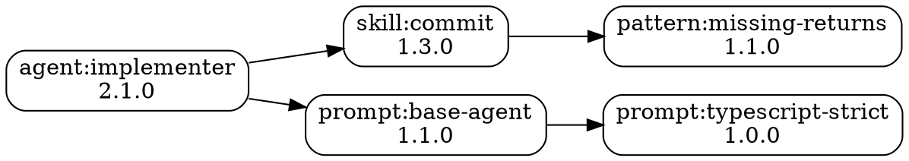

# Show Artifact Dependencies

## Context
Display dependency graph for artifacts in the universal library system. Shows what an artifact depends on (dependencies), what depends on it (reverse dependencies), detects circular dependencies, displays version requirements, and visualizes the complete dependency tree.

Supports all artifact types: skills, agents, prompts, workflows, MCP configs, extensions, and learnings.

## Input
Artifact identifier with optional output formats:
- `<artifact>` - Artifact to analyze (e.g., `agent:implementer`, `skill:commit`)
- `--reverse` - Show reverse dependencies (what depends on this artifact)
- `--tree` - Display as text tree (default)
- `--graph` - Display as visual graph with ASCII art
- `--json` - Output as JSON
- `--flat` - Flat list format
- `--depth <n>` - Maximum depth to traverse (default: unlimited)
- `--all` - Show all artifacts and their dependencies
- `--circular` - Detect and highlight circular dependencies
- `--versions` - Show version requirements
- `--transitive` - Include transitive dependencies
- `--stats` - Show dependency statistics
- `--dot` - Output in DOT format (for Graphviz)

## Steps

### 1. Load Configuration

```bash
# Load library configuration
source ~/.pi/config.sh 2>/dev/null || echo "No global config"

CENTRAL_PATH="${PI_LIBRARY_CENTRAL:-$HOME/.pi/library-central}"
CENTRAL_CATALOG="$CENTRAL_PATH/catalog.yaml"
PROJECT_DIR=".pi"

# Validate central library exists
if [ ! -d "$CENTRAL_PATH" ]; then
  echo "❌ Central library not initialized"
  echo ""
  echo "Initialize first with:"
  echo "  /library init"
  exit 1
fi

if [ ! -f "$CENTRAL_CATALOG" ]; then
  echo "❌ Central catalog not found at: $CENTRAL_CATALOG"
  exit 1
fi
```

### 2. Parse Arguments

```bash
ARTIFACT=""
SHOW_REVERSE=false
OUTPUT_FORMAT="tree"  # tree, graph, json, flat, dot
MAX_DEPTH=-1  # -1 = unlimited
SHOW_ALL=false
CHECK_CIRCULAR=false
SHOW_VERSIONS=false
SHOW_TRANSITIVE=false
SHOW_STATS=false

while [ $# -gt 0 ]; do
  case "$1" in
    --reverse)
      SHOW_REVERSE=true
      shift
      ;;
    --tree)
      OUTPUT_FORMAT="tree"
      shift
      ;;
    --graph)
      OUTPUT_FORMAT="graph"
      shift
      ;;
    --json)
      OUTPUT_FORMAT="json"
      shift
      ;;
    --flat)
      OUTPUT_FORMAT="flat"
      shift
      ;;
    --dot)
      OUTPUT_FORMAT="dot"
      shift
      ;;
    --depth)
      MAX_DEPTH="$2"
      shift 2
      ;;
    --all)
      SHOW_ALL=true
      shift
      ;;
    --circular)
      CHECK_CIRCULAR=true
      shift
      ;;
    --versions)
      SHOW_VERSIONS=true
      shift
      ;;
    --transitive)
      SHOW_TRANSITIVE=true
      shift
      ;;
    --stats)
      SHOW_STATS=true
      shift
      ;;
    *)
      if [ -z "$ARTIFACT" ]; then
        ARTIFACT="$1"
      fi
      shift
      ;;
  esac
done

# Validate artifact unless showing all
if [ -z "$ARTIFACT" ] && [ "$SHOW_ALL" = "false" ]; then
  echo "❌ Artifact identifier required"
  echo ""
  echo "Usage:"
  echo "  /library deps <artifact> [options]"
  echo ""
  echo "Examples:"
  echo "  /library deps agent:implementer"
  echo "  /library deps skill:commit --reverse"
  echo "  /library deps agent:implementer --graph"
  echo "  /library deps --all --circular"
  exit 1
fi
```

### 3. Parse Artifact Metadata

```bash
# Parse artifact type and name
parse_artifact_id() {
  local artifact_id="$1"

  if [[ "$artifact_id" =~ ^([a-z]+):(.+)$ ]]; then
    ARTIFACT_TYPE="${BASH_REMATCH[1]}"
    ARTIFACT_NAME="${BASH_REMATCH[2]}"
  else
    echo "❌ Invalid artifact format: $artifact_id"
    echo ""
    echo "Expected format: type:name"
    echo "Examples: agent:implementer, skill:commit, prompt:base-agent"
    exit 1
  fi
}

# Map artifact type to directory
get_artifact_dir() {
  local type="$1"

  case "$type" in
    skill) echo "skills" ;;
    agent) echo "agents" ;;
    prompt) echo "prompts" ;;
    workflow) echo "workflows" ;;
    mcp) echo "mcp-configs" ;;
    ext) echo "extensions" ;;
    pattern|learning) echo "learnings" ;;
    *)
      echo "❌ Unknown artifact type: $type" >&2
      return 1
      ;;
  esac
}

if [ -n "$ARTIFACT" ]; then
  parse_artifact_id "$ARTIFACT"
  ARTIFACT_DIR=$(get_artifact_dir "$ARTIFACT_TYPE")
fi
```

### 4. Extract Dependencies from Catalog

```bash
# Extract dependencies for an artifact from catalog
get_dependencies() {
  local artifact_id="$1"
  local artifact_type="${artifact_id%%:*}"
  local artifact_name="${artifact_id##*:}"

  # This would use proper YAML parser (yq) in production
  # Simplified grep-based extraction for demonstration

  local section
  case "$artifact_type" in
    skill) section="skills" ;;
    agent) section="agents" ;;
    prompt) section="prompts" ;;
    workflow) section="workflows" ;;
    mcp) section="mcp_configs" ;;
    ext) section="extensions" ;;
    pattern|learning) section="learnings" ;;
  esac

  # Extract dependencies from catalog
  # Look for pattern: "name: <artifact_name>" followed by "dependencies:" section
  local in_artifact=false
  local in_deps=false
  local deps=()

  while IFS= read -r line; do
    # Check if we're in the right artifact
    if [[ "$line" =~ ^[[:space:]]*-[[:space:]]*name:[[:space:]]*\"?${artifact_name}\"? ]]; then
      in_artifact=true
    fi

    if [ "$in_artifact" = true ]; then
      # Check for dependencies section
      if [[ "$line" =~ ^[[:space:]]*dependencies: ]]; then
        in_deps=true
        continue
      fi

      # In dependencies section, collect items
      if [ "$in_deps" = true ]; then
        # End of dependencies section
        if [[ "$line" =~ ^[[:space:]]*[a-z_]+: ]] && [[ ! "$line" =~ ^[[:space:]]*- ]]; then
          break
        fi

        # Extract dependency
        if [[ "$line" =~ ^[[:space:]]*-[[:space:]]*(.+)$ ]]; then
          local dep="${BASH_REMATCH[1]}"
          dep="${dep//\"/}"  # Remove quotes
          dep="${dep// /}"   # Remove spaces
          deps+=("$dep")
        fi
      fi

      # Check if we've moved to next artifact
      if [[ "$line" =~ ^[[:space:]]*-[[:space:]]*name: ]] && [ "$in_deps" = true ]; then
        break
      fi
    fi
  done < "$CENTRAL_CATALOG"

  # Return dependencies as space-separated string
  echo "${deps[@]}"
}

# Get version requirement for dependency
get_version_requirement() {
  local artifact_id="$1"
  local artifact_type="${artifact_id%%:*}"
  local artifact_name="${artifact_id##*:}"

  # Extract version from catalog
  grep -A 2 "name: \"$artifact_name\"" "$CENTRAL_CATALOG" | grep "version:" | cut -d: -f2 | xargs || echo "latest"
}
```

### 5. Build Dependency Graph

```bash
# Build complete dependency graph
declare -A DEPENDENCY_MAP
declare -A REVERSE_DEPENDENCY_MAP
declare -A VERSION_MAP
declare -A VISITED_ARTIFACTS

build_dependency_graph() {
  local artifact_id="$1"
  local current_depth="${2:-0}"

  # Check depth limit
  if [ "$MAX_DEPTH" -ge 0 ] && [ "$current_depth" -ge "$MAX_DEPTH" ]; then
    return
  fi

  # Skip if already visited (prevent infinite loops)
  if [ "${VISITED_ARTIFACTS[$artifact_id]}" = "true" ]; then
    return
  fi

  VISITED_ARTIFACTS[$artifact_id]="true"

  # Get dependencies for this artifact
  local deps=$(get_dependencies "$artifact_id")

  if [ -n "$deps" ]; then
    DEPENDENCY_MAP[$artifact_id]="$deps"

    # Build reverse dependency map
    for dep in $deps; do
      if [ -z "${REVERSE_DEPENDENCY_MAP[$dep]}" ]; then
        REVERSE_DEPENDENCY_MAP[$dep]="$artifact_id"
      else
        REVERSE_DEPENDENCY_MAP[$dep]="${REVERSE_DEPENDENCY_MAP[$dep]} $artifact_id"
      fi

      # Get version if requested
      if [ "$SHOW_VERSIONS" = "true" ]; then
        VERSION_MAP[$dep]=$(get_version_requirement "$dep")
      fi

      # Recursively build graph for dependencies
      if [ "$SHOW_TRANSITIVE" = "true" ]; then
        build_dependency_graph "$dep" $((current_depth + 1))
      fi
    done
  fi
}

# Build graph for single artifact or all artifacts
if [ "$SHOW_ALL" = "true" ]; then
  # Get all artifacts from catalog
  # This would parse all artifact sections in production

  # Simplified: search for all artifacts
  for type in skills agents prompts workflows mcp_configs extensions learnings; do
    artifact_dir=$(get_artifact_dir "${type%s}")
    [ -d "$CENTRAL_PATH/$artifact_dir" ] || continue

    # Find all artifacts of this type
    for artifact_file in "$CENTRAL_PATH/$artifact_dir"/*; do
      [ -e "$artifact_file" ] || continue

      artifact_name=$(basename "$artifact_file" | sed 's/\.[^.]*$//' | sed 's/SKILL$//')
      artifact_id="${type%s}:$artifact_name"

      build_dependency_graph "$artifact_id"
    done
  done
else
  build_dependency_graph "$ARTIFACT"
fi
```

### 6. Detect Circular Dependencies

```bash
# Detect circular dependencies using DFS
declare -A VISIT_STATUS  # white=0, gray=1, black=2
declare -a CIRCULAR_DEPS

detect_circular_deps() {
  local artifact_id="$1"
  local path="${2:-$artifact_id}"

  # Mark as being visited (gray)
  VISIT_STATUS[$artifact_id]=1

  local deps="${DEPENDENCY_MAP[$artifact_id]}"

  for dep in $deps; do
    if [ "${VISIT_STATUS[$dep]}" = "1" ]; then
      # Found a cycle
      CIRCULAR_DEPS+=("$path → $dep")
    elif [ "${VISIT_STATUS[$dep]}" != "2" ]; then
      # Continue DFS
      detect_circular_deps "$dep" "$path → $dep"
    fi
  done

  # Mark as fully visited (black)
  VISIT_STATUS[$artifact_id]=2
}

if [ "$CHECK_CIRCULAR" = "true" ]; then
  # Initialize all artifacts as unvisited (white)
  for artifact_id in "${!DEPENDENCY_MAP[@]}"; do
    VISIT_STATUS[$artifact_id]=0
  done

  # Run DFS from each unvisited artifact
  for artifact_id in "${!DEPENDENCY_MAP[@]}"; do
    if [ "${VISIT_STATUS[$artifact_id]}" = "0" ]; then
      detect_circular_deps "$artifact_id"
    fi
  done
fi
```

### 7. Calculate Statistics

```bash
# Calculate dependency statistics
calculate_stats() {
  TOTAL_ARTIFACTS=${#DEPENDENCY_MAP[@]}
  TOTAL_DEPENDENCIES=0
  MAX_DEPTH_FOUND=0
  ARTIFACTS_WITH_DEPS=0
  ARTIFACTS_WITHOUT_DEPS=0

  for artifact_id in "${!DEPENDENCY_MAP[@]}"; do
    local dep_count=$(echo "${DEPENDENCY_MAP[$artifact_id]}" | wc -w)

    if [ "$dep_count" -gt 0 ]; then
      ARTIFACTS_WITH_DEPS=$((ARTIFACTS_WITH_DEPS + 1))
      TOTAL_DEPENDENCIES=$((TOTAL_DEPENDENCIES + dep_count))
    else
      ARTIFACTS_WITHOUT_DEPS=$((ARTIFACTS_WITHOUT_DEPS + 1))
    fi
  done

  # Calculate average
  if [ "$ARTIFACTS_WITH_DEPS" -gt 0 ]; then
    AVG_DEPENDENCIES=$((TOTAL_DEPENDENCIES / ARTIFACTS_WITH_DEPS))
  else
    AVG_DEPENDENCIES=0
  fi

  # Find most depended-on artifacts
  declare -A DEP_COUNTS
  for artifact_id in "${!REVERSE_DEPENDENCY_MAP[@]}"; do
    local count=$(echo "${REVERSE_DEPENDENCY_MAP[$artifact_id]}" | wc -w)
    DEP_COUNTS[$artifact_id]=$count
  done
}

if [ "$SHOW_STATS" = "true" ]; then
  calculate_stats
fi
```

### 8. Output: Tree Format

```bash
# Display as text tree
output_tree() {
  local artifact_id="$1"
  local prefix="${2:-}"
  local is_last="${3:-true}"
  local visited_path="${4:-}"
  local current_depth="${5:-0}"

  # Check depth limit
  if [ "$MAX_DEPTH" -ge 0 ] && [ "$current_depth" -ge "$MAX_DEPTH" ]; then
    return
  fi

  # Check for circular reference
  if [[ "$visited_path" == *"$artifact_id"* ]]; then
    echo "${prefix}└── $artifact_id [CIRCULAR]"
    return
  fi

  # Print current artifact
  local version=""
  if [ "$SHOW_VERSIONS" = "true" ] && [ -n "${VERSION_MAP[$artifact_id]}" ]; then
    version=" (${VERSION_MAP[$artifact_id]})"
  fi

  if [ -z "$prefix" ]; then
    echo "$artifact_id$version"
  else
    local connector="└──"
    [ "$is_last" = false ] && connector="├──"
    echo "${prefix}${connector} $artifact_id$version"
  fi

  # Get dependencies
  local deps="${DEPENDENCY_MAP[$artifact_id]}"

  if [ -n "$deps" ]; then
    local dep_array=($deps)
    local dep_count=${#dep_array[@]}
    local new_visited="$visited_path $artifact_id"

    for i in "${!dep_array[@]}"; do
      local dep="${dep_array[$i]}"
      local is_last_dep=true
      [ $((i + 1)) -lt "$dep_count" ] && is_last_dep=false

      local new_prefix="$prefix"
      if [ -n "$prefix" ]; then
        if [ "$is_last" = true ]; then
          new_prefix="${prefix}    "
        else
          new_prefix="${prefix}│   "
        fi
      else
        new_prefix="  "
      fi

      output_tree "$dep" "$new_prefix" "$is_last_dep" "$new_visited" $((current_depth + 1))
    done
  fi
}

# Display reverse dependencies as tree
output_reverse_tree() {
  local artifact_id="$1"
  local prefix="${2:-}"
  local is_last="${3:-true}"

  # Print current artifact
  if [ -z "$prefix" ]; then
    echo "$artifact_id (depended on by:)"
  else
    local connector="└──"
    [ "$is_last" = false ] && connector="├──"
    echo "${prefix}${connector} $artifact_id"
  fi

  # Get reverse dependencies
  local reverse_deps="${REVERSE_DEPENDENCY_MAP[$artifact_id]}"

  if [ -n "$reverse_deps" ]; then
    local dep_array=($reverse_deps)
    local dep_count=${#dep_array[@]}

    for i in "${!dep_array[@]}"; do
      local dep="${dep_array[$i]}"
      local is_last_dep=true
      [ $((i + 1)) -lt "$dep_count" ] && is_last_dep=false

      local new_prefix="$prefix"
      if [ -n "$prefix" ]; then
        if [ "$is_last" = true ]; then
          new_prefix="${prefix}    "
        else
          new_prefix="${prefix}│   "
        fi
      else
        new_prefix="  "
      fi

      echo "${new_prefix}$([ "$is_last_dep" = false ] && echo "├──" || echo "└──") $dep"
    done
  fi
}

if [ "$OUTPUT_FORMAT" = "tree" ]; then
  if [ "$SHOW_REVERSE" = "true" ]; then
    output_reverse_tree "$ARTIFACT"
  else
    output_tree "$ARTIFACT"
  fi
fi
```

### 9. Output: Graph Format (ASCII Art)

```bash
# Display as ASCII graph
output_graph() {
  local artifact_id="$1"

  echo "Dependency Graph"
  echo "════════════════"
  echo ""

  # Box drawing for main artifact
  local artifact_display="$artifact_id"
  local box_width=$((${#artifact_display} + 4))

  # Top border
  printf "┌"
  printf "─%.0s" $(seq 1 $((box_width - 2)))
  printf "┐\n"

  # Artifact name
  printf "│ %s │\n" "$artifact_display"

  # Bottom border
  printf "└"
  printf "─%.0s" $(seq 1 $((box_width - 2)))
  printf "┘\n"

  # Dependencies
  local deps="${DEPENDENCY_MAP[$artifact_id]}"

  if [ -n "$deps" ]; then
    echo "    │"
    echo "    ▼"
    echo ""

    local dep_array=($deps)
    for dep in "${dep_array[@]}"; do
      local dep_width=$((${#dep} + 4))

      # Indent
      printf "  "

      # Box
      printf "┌"
      printf "─%.0s" $(seq 1 $((dep_width - 2)))
      printf "┐\n"

      printf "  │ %s │" "$dep"

      # Show version if requested
      if [ "$SHOW_VERSIONS" = "true" ] && [ -n "${VERSION_MAP[$dep]}" ]; then
        printf " (%s)" "${VERSION_MAP[$dep]}"
      fi
      printf "\n"

      printf "  └"
      printf "─%.0s" $(seq 1 $((dep_width - 2)))
      printf "┘\n"

      # Show sub-dependencies
      local sub_deps="${DEPENDENCY_MAP[$dep]}"
      if [ -n "$sub_deps" ]; then
        echo "      │"
        echo "      ├─→ ${sub_deps// /, }"
      fi

      echo ""
    done
  else
    echo ""
    echo "  (no dependencies)"
  fi
}

if [ "$OUTPUT_FORMAT" = "graph" ]; then
  output_graph "$ARTIFACT"
fi
```

### 10. Output: Flat Format

```bash
# Display as flat list
output_flat() {
  local artifact_id="$1"

  echo "Dependencies for: $artifact_id"
  echo ""

  local deps="${DEPENDENCY_MAP[$artifact_id]}"

  if [ -n "$deps" ]; then
    echo "Direct dependencies:"
    for dep in $deps; do
      local version=""
      if [ "$SHOW_VERSIONS" = "true" ] && [ -n "${VERSION_MAP[$dep]}" ]; then
        version=" (${VERSION_MAP[$dep]})"
      fi
      echo "  - $dep$version"
    done

    if [ "$SHOW_TRANSITIVE" = "true" ]; then
      echo ""
      echo "Transitive dependencies:"

      # Collect all transitive dependencies
      declare -A all_deps
      collect_transitive_deps() {
        local aid="$1"
        local d="${DEPENDENCY_MAP[$aid]}"

        for dep in $d; do
          if [ -z "${all_deps[$dep]}" ]; then
            all_deps[$dep]=1
            collect_transitive_deps "$dep"
          fi
        done
      }

      collect_transitive_deps "$artifact_id"

      for dep in "${!all_deps[@]}"; do
        # Skip direct dependencies
        if [[ " $deps " != *" $dep "* ]]; then
          echo "  - $dep"
        fi
      done
    fi
  else
    echo "  (no dependencies)"
  fi

  if [ "$SHOW_REVERSE" = "true" ]; then
    echo ""
    echo "Depended on by:"

    local reverse_deps="${REVERSE_DEPENDENCY_MAP[$artifact_id]}"
    if [ -n "$reverse_deps" ]; then
      for dep in $reverse_deps; do
        echo "  - $dep"
      done
    else
      echo "  (nothing depends on this)"
    fi
  fi
}

if [ "$OUTPUT_FORMAT" = "flat" ]; then
  output_flat "$ARTIFACT"
fi
```

### 11. Output: JSON Format

```bash
# Display as JSON
output_json() {
  local artifact_id="$1"

  echo "{"
  echo "  \"artifact\": \"$artifact_id\","
  echo "  \"dependencies\": ["

  local deps="${DEPENDENCY_MAP[$artifact_id]}"
  if [ -n "$deps" ]; then
    local dep_array=($deps)
    local dep_count=${#dep_array[@]}

    for i in "${!dep_array[@]}"; do
      local dep="${dep_array[$i]}"
      local version="${VERSION_MAP[$dep]:-latest}"

      echo -n "    {\"id\": \"$dep\", \"version\": \"$version\"}"

      if [ $((i + 1)) -lt "$dep_count" ]; then
        echo ","
      else
        echo ""
      fi
    done
  fi

  echo "  ],"

  if [ "$SHOW_REVERSE" = "true" ]; then
    echo "  \"depended_on_by\": ["

    local reverse_deps="${REVERSE_DEPENDENCY_MAP[$artifact_id]}"
    if [ -n "$reverse_deps" ]; then
      local rdep_array=($reverse_deps)
      local rdep_count=${#rdep_array[@]}

      for i in "${!rdep_array[@]}"; do
        local rdep="${rdep_array[$i]}"

        echo -n "    \"$rdep\""

        if [ $((i + 1)) -lt "$rdep_count" ]; then
          echo ","
        else
          echo ""
        fi
      done
    fi

    echo "  ],"
  fi

  if [ "$SHOW_TRANSITIVE" = "true" ]; then
    echo "  \"transitive_dependencies\": ["
    # Implementation for transitive deps in JSON
    echo "  ],"
  fi

  # Remove trailing comma from last property
  echo "  \"total_dependencies\": $(echo "$deps" | wc -w)"
  echo "}"
}

if [ "$OUTPUT_FORMAT" = "json" ]; then
  output_json "$ARTIFACT"
fi
```

### 12. Output: DOT Format (Graphviz)

```bash
# Output in DOT format for Graphviz
output_dot() {
  echo "digraph Dependencies {"
  echo "  rankdir=LR;"
  echo "  node [shape=box, style=rounded];"
  echo ""

  # Output all artifacts as nodes
  for artifact_id in "${!DEPENDENCY_MAP[@]}"; do
    local label="$artifact_id"

    if [ "$SHOW_VERSIONS" = "true" ] && [ -n "${VERSION_MAP[$artifact_id]}" ]; then
      label="$artifact_id\\n${VERSION_MAP[$artifact_id]}"
    fi

    # Escape special characters
    local node_id="${artifact_id//:/_}"
    echo "  \"$node_id\" [label=\"$label\"];"
  done

  echo ""

  # Output all dependencies as edges
  for artifact_id in "${!DEPENDENCY_MAP[@]}"; do
    local deps="${DEPENDENCY_MAP[$artifact_id]}"

    if [ -n "$deps" ]; then
      local node_id="${artifact_id//:/_}"

      for dep in $deps; do
        local dep_id="${dep//:/_}"
        echo "  \"$node_id\" -> \"$dep_id\";"
      done
    fi
  done

  echo "}"
  echo ""
  echo "# To render this graph, save to file and run:"
  echo "# dot -Tpng deps.dot -o deps.png"
}

if [ "$OUTPUT_FORMAT" = "dot" ]; then
  output_dot
fi
```

### 13. Display Circular Dependencies

```bash
# Show circular dependencies if detected
if [ "$CHECK_CIRCULAR" = "true" ] && [ ${#CIRCULAR_DEPS[@]} -gt 0 ]; then
  echo ""
  echo "⚠️  Circular Dependencies Detected"
  echo "═════════════════════════════════"
  echo ""

  for cycle in "${CIRCULAR_DEPS[@]}"; do
    echo "  🔄 $cycle"
  done

  echo ""
  echo "Circular dependencies should be resolved to prevent issues."
  echo ""
fi
```

### 14. Display Statistics

```bash
# Show statistics if requested
if [ "$SHOW_STATS" = "true" ]; then
  echo ""
  echo "Dependency Statistics"
  echo "═══════════════════════"
  echo ""
  echo "  Total artifacts analyzed: $TOTAL_ARTIFACTS"
  echo "  Artifacts with dependencies: $ARTIFACTS_WITH_DEPS"
  echo "  Artifacts without dependencies: $ARTIFACTS_WITHOUT_DEPS"
  echo "  Total dependency relationships: $TOTAL_DEPENDENCIES"
  echo "  Average dependencies per artifact: $AVG_DEPENDENCIES"
  echo ""

  if [ ${#CIRCULAR_DEPS[@]} -gt 0 ]; then
    echo "  ⚠️  Circular dependencies found: ${#CIRCULAR_DEPS[@]}"
  else
    echo "  ✅ No circular dependencies detected"
  fi

  echo ""

  # Most depended-on artifacts
  echo "Most depended-on artifacts:"
  echo ""

  # Sort by dependency count
  for artifact_id in "${!REVERSE_DEPENDENCY_MAP[@]}"; do
    local count=$(echo "${REVERSE_DEPENDENCY_MAP[$artifact_id]}" | wc -w)
    echo "$count $artifact_id"
  done | sort -rn | head -5 | while read count aid; do
    echo "  - $aid (depended on by $count artifacts)"
  done

  echo ""
fi
```

### 15. Display All Artifacts Mode

```bash
# Show all artifacts and their dependencies
if [ "$SHOW_ALL" = "true" ]; then
  echo "All Artifact Dependencies"
  echo "═════════════════════════"
  echo ""

  for artifact_id in "${!DEPENDENCY_MAP[@]}"; do
    local deps="${DEPENDENCY_MAP[$artifact_id]}"
    local dep_count=$(echo "$deps" | wc -w)

    echo "📦 $artifact_id"

    if [ "$dep_count" -gt 0 ]; then
      echo "   Dependencies ($dep_count):"
      for dep in $deps; do
        echo "     → $dep"
      done
    else
      echo "   (no dependencies)"
    fi

    if [ "$SHOW_REVERSE" = "true" ]; then
      local reverse_deps="${REVERSE_DEPENDENCY_MAP[$artifact_id]}"
      local rdep_count=$(echo "$reverse_deps" | wc -w)

      if [ "$rdep_count" -gt 0 ]; then
        echo "   Depended on by ($rdep_count):"
        for rdep in $reverse_deps; do
          echo "     ← $rdep"
        done
      fi
    fi

    echo ""
  done
fi
```

## Example Outputs

### Basic Dependencies (Tree Format)

```bash
/library deps agent:implementer
```

**Output:**
```
agent:implementer
  ├── skill:commit
  │   └── pattern:missing-returns
  └── prompt:base-agent
      └── prompt:typescript-strict
```

---

### Dependencies with Versions

```bash
/library deps agent:implementer --versions
```

**Output:**
```
agent:implementer (2.1.0)
  ├── skill:commit (1.3.0)
  │   └── pattern:missing-returns (1.1.0)
  └── prompt:base-agent (1.1.0)
      └── prompt:typescript-strict (1.0.0)
```

---

### Reverse Dependencies

```bash
/library deps prompt:base-agent --reverse
```

**Output:**
```
prompt:base-agent (depended on by:)
  ├── agent:implementer
  ├── agent:reviewer
  ├── agent:architect
  ├── agent:fixer
  ├── prompt:convex-specialist
  └── prompt:testing-specialist
```

---

### Graph Format (ASCII Art)

```bash
/library deps agent:implementer --graph
```

**Output:**
```
Dependency Graph
════════════════

┌──────────────────────┐
│ agent:implementer    │
└──────────────────────┘
    │
    ▼

  ┌────────────────┐
  │ skill:commit   │
  └────────────────┘
      │
      ├─→ pattern:missing-returns

  ┌────────────────────┐
  │ prompt:base-agent  │
  └────────────────────┘
      │
      ├─→ prompt:typescript-strict

```

---

### Flat Format with Transitive Dependencies

```bash
/library deps agent:implementer --flat --transitive
```

**Output:**
```
Dependencies for: agent:implementer

Direct dependencies:
  - skill:commit (1.3.0)
  - prompt:base-agent (1.1.0)

Transitive dependencies:
  - pattern:missing-returns
  - prompt:typescript-strict
```

---

### JSON Format

```bash
/library deps agent:implementer --json
```

**Output:**
```json
{
  "artifact": "agent:implementer",
  "dependencies": [
    {"id": "skill:commit", "version": "1.3.0"},
    {"id": "prompt:base-agent", "version": "1.1.0"}
  ],
  "total_dependencies": 2
}
```

---

### JSON with Reverse Dependencies

```bash
/library deps prompt:base-agent --json --reverse
```

**Output:**
```json
{
  "artifact": "prompt:base-agent",
  "dependencies": [
    {"id": "prompt:typescript-strict", "version": "1.0.0"}
  ],
  "depended_on_by": [
    "agent:implementer",
    "agent:reviewer",
    "agent:architect",
    "agent:fixer",
    "prompt:convex-specialist"
  ],
  "total_dependencies": 1
}
```

---

### Detect Circular Dependencies

```bash
/library deps --all --circular
```

**Output:**
```
All Artifact Dependencies
═════════════════════════

[... artifact list ...]

⚠️  Circular Dependencies Detected
═════════════════════════════════

  🔄 prompt:convex-specialist → prompt:base-agent → prompt:convex-specialist
  🔄 agent:implementer → skill:commit → agent:implementer

Circular dependencies should be resolved to prevent issues.
```

---

### Dependency Statistics

```bash
/library deps --all --stats
```

**Output:**
```
All Artifact Dependencies
═════════════════════════

[... artifact list ...]

Dependency Statistics
═══════════════════════

  Total artifacts analyzed: 47
  Artifacts with dependencies: 32
  Artifacts without dependencies: 15
  Total dependency relationships: 89
  Average dependencies per artifact: 2

  ✅ No circular dependencies detected

Most depended-on artifacts:
  - prompt:base-agent (depended on by 12 artifacts)
  - skill:commit (depended on by 8 artifacts)
  - prompt:typescript-strict (depended on by 6 artifacts)
  - pattern:missing-returns (depended on by 5 artifacts)
  - skill:learnings (depended on by 4 artifacts)
```

---

### DOT Format (Graphviz)

```bash
/library deps agent:implementer --dot > deps.dot
```

**Output:**


Then render with:
```bash
dot -Tpng deps.dot -o deps.png
open deps.png
```

---

### Limited Depth

```bash
/library deps agent:implementer --depth 1
```

**Output:**
```
agent:implementer
  ├── skill:commit
  └── prompt:base-agent
```

---

### Complex Dependency Tree

```bash
/library deps agent:implementer --transitive
```

**Output:**
```
agent:implementer (2.1.0)
  ├── skill:commit (1.3.0)
  │   ├── skill:learnings (1.2.0)
  │   │   └── pattern:missing-returns (1.1.0)
  │   └── pattern:missing-returns (1.1.0)
  └── prompt:base-agent (1.1.0)
      ├── prompt:typescript-strict (1.0.0)
      └── prompt:error-handling (1.0.0)
          └── pattern:forgot-error-handling (1.0.0)
```

---

### All Artifacts with Dependencies

```bash
/library deps --all
```

**Output:**
```
All Artifact Dependencies
═════════════════════════

📦 agent:implementer
   Dependencies (2):
     → skill:commit
     → prompt:base-agent

📦 agent:reviewer
   Dependencies (2):
     → skill:review-pr
     → prompt:base-agent

📦 agent:architect
   Dependencies (1):
     → prompt:base-agent

📦 skill:commit
   Dependencies (1):
     → pattern:missing-returns

📦 prompt:base-agent
   Dependencies (1):
     → prompt:typescript-strict

📦 prompt:convex-specialist
   Dependencies (2):
     → prompt:base-agent
     → prompt:database-patterns

[... more artifacts ...]
```

---

### All Artifacts with Reverse Dependencies

```bash
/library deps --all --reverse
```

**Output:**
```
All Artifact Dependencies
═════════════════════════

📦 agent:implementer
   Dependencies (2):
     → skill:commit
     → prompt:base-agent

📦 prompt:base-agent
   Dependencies (1):
     → prompt:typescript-strict
   Depended on by (6):
     ← agent:implementer
     ← agent:reviewer
     ← agent:architect
     ← agent:fixer
     ← prompt:convex-specialist
     ← prompt:testing-specialist

[... more artifacts ...]
```

---

## Usage Examples

### Check Dependencies Before Installing

```bash
# See what will be installed
/library deps agent:implementer

# Shows:
# - skill:commit (will be installed)
# - prompt:base-agent (will be installed)

# Install with dependencies
/library install agent:implementer
```

---

### Find What Depends on an Artifact

```bash
# Before removing or modifying
/library deps prompt:base-agent --reverse

# Shows all agents/prompts that depend on it
# Helps avoid breaking changes
```

---

### Validate No Circular Dependencies

```bash
# Check entire library
/library deps --all --circular

# If clean:
# ✅ No circular dependencies detected

# If issues:
# ⚠️  Circular Dependencies Detected
#   🔄 prompt:a → prompt:b → prompt:a
```

---

### Generate Dependency Documentation

```bash
# Export as markdown-friendly tree
/library deps --all > docs/dependencies.md

# Export as graph image
/library deps --all --dot > deps.dot
dot -Tpng deps.dot -o docs/dependency-graph.png
```

---

### Analyze Dependency Depth

```bash
# Find deeply nested dependencies
/library deps agent:implementer --transitive --stats

# Shows:
# - Total depth of dependency tree
# - Transitive dependency count
# - Potential for optimization
```

---

### Find Most Critical Artifacts

```bash
# Most depended-on artifacts
/library deps --all --stats

# Shows:
#   Most depended-on artifacts:
#   - prompt:base-agent (12 dependents)
#   - skill:commit (8 dependents)
#
# These are critical - changes affect many artifacts
```

---

### Debug Missing Dependencies

```bash
# If install fails, check dependencies
/library deps agent:implementer --transitive

# Shows full dependency tree
# Identifies missing or broken dependencies
```

---

### Plan Refactoring

```bash
# Before breaking up a large prompt
/library deps prompt:base-agent --reverse

# Shows all dependents
# Plan migration path for each dependent
```

---

## Integration with Workflow

### Before Installation

```bash
# Check what will be installed
/library deps agent:implementer

# Review dependencies
# Then install
/library install agent:implementer
```

---

### Before Removal

```bash
# Check reverse dependencies
/library deps skill:commit --reverse

# If nothing depends on it:
#   (nothing depends on this)
# Safe to remove

# If dependents exist:
#   Depended on by:
#   - agent:implementer
#   - agent:fixer
# Remove dependents first or find alternatives
```

---

### Dependency Health Check

```bash
# Weekly check
/library deps --all --circular --stats

# Verify:
# ✅ No circular dependencies
# ✅ Dependency counts reasonable
# ✅ No orphaned artifacts
```

---

### Document Architecture

```bash
# Generate dependency graph
/library deps --all --dot > docs/architecture.dot

# Render to multiple formats
dot -Tpng docs/architecture.dot -o docs/architecture.png
dot -Tsvg docs/architecture.dot -o docs/architecture.svg
dot -Tpdf docs/architecture.dot -o docs/architecture.pdf

# Include in documentation
```

---

## Error Handling

**Artifact not found:**
```
❌ Artifact not found: agent:unknown

Available agents:
  - agent:implementer
  - agent:reviewer
  - agent:architect
  [...]

Search for artifacts:
  /library search unknown
```

**Invalid artifact format:**
```
❌ Invalid artifact format: invalid-format

Expected format: type:name
Examples: agent:implementer, skill:commit, prompt:base-agent
```

**Circular dependency warning:**
```
⚠️  Warning: Circular dependency detected

agent:a depends on agent:b
agent:b depends on agent:a

This may cause issues during installation or resolution.
Consider refactoring to remove the cycle.
```

**No dependencies:**
```
skill:standalone

  (no dependencies)

This artifact has no dependencies and can be installed independently.
```

---

## Advanced Features

### Dependency Resolution Order

```bash
# Show install order based on dependencies
/library deps agent:implementer --install-order

Output:
  Install order for agent:implementer:
  1. pattern:missing-returns (no dependencies)
  2. prompt:typescript-strict (no dependencies)
  3. skill:commit (depends on: pattern:missing-returns)
  4. prompt:base-agent (depends on: prompt:typescript-strict)
  5. agent:implementer (depends on: skill:commit, prompt:base-agent)
```

---

### Dependency Impact Analysis

```bash
# Show what breaks if artifact is removed
/library deps prompt:base-agent --impact

Output:
  Removal Impact Analysis for prompt:base-agent:

  Direct impact (6 artifacts):
    - agent:implementer
    - agent:reviewer
    - agent:architect
    - agent:fixer
    - prompt:convex-specialist
    - prompt:testing-specialist

  Transitive impact (12 artifacts):
    [artifacts that depend on the above]

  Total affected: 18 artifacts

  ⚠️  High impact removal - affects 18 artifacts
```

---

### Dependency Diff Between Projects

```bash
# Compare dependencies with another project
/library deps agent:implementer --compare ~/projects/other-project

Output:
  Dependency Diff:

  Same dependencies:
    ✓ skill:commit
    ✓ prompt:base-agent

  Only in this project:
    + prompt:convex-specialist

  Only in other-project:
    - prompt:supabase-specialist
```

---

### Export Dependency Matrix

```bash
# Generate dependency matrix for documentation
/library deps --all --matrix > dependency-matrix.csv

# Creates CSV:
# artifact,skill:commit,prompt:base-agent,...
# agent:implementer,1,1,0,0,...
# agent:reviewer,0,1,0,0,...
```

---

## See Also

- Install artifact with dependencies: `/library install agent:implementer`
- Search for artifacts: `/library search <query>`
- View artifact details: `/library status --show-agents`
- Push artifact with dependencies: `/library push agent:implementer`
- Sync all artifacts: `/library sync`
